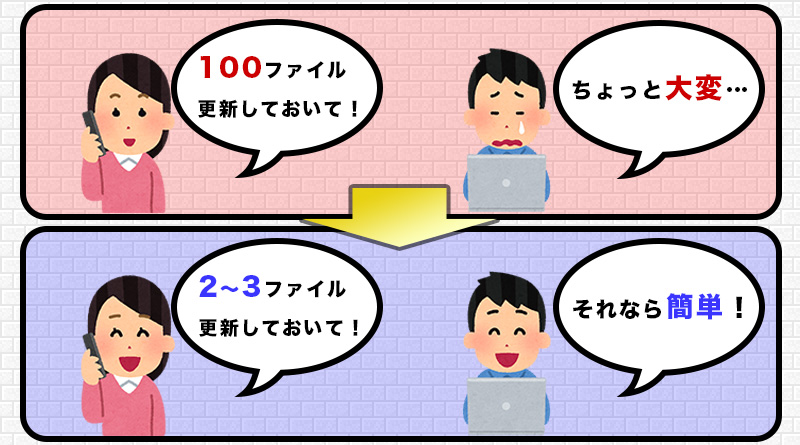
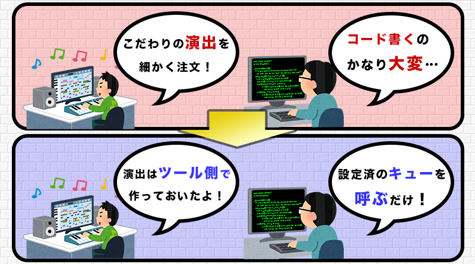
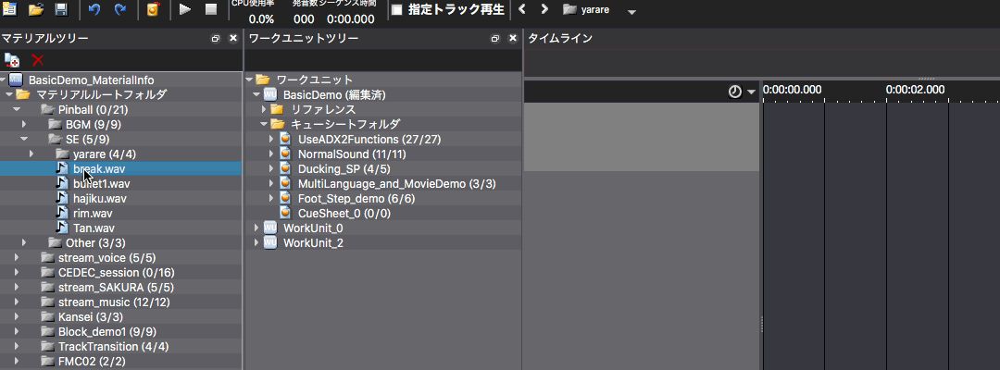

## ADX教程篇 Part 0：需要首先了解的CRI ADX2信息

本教程将使用Python3作为脚本语言。已经将Python环境在AtomCraft中配置好的读者可以跳过这一节。

### ADX2可以做什么？
ADX是一个使游戏声音制作和声音素材管理更便利的工具和程序的集合体。它有足够的潜力满足各种岗位的开发者。

### 管理更加便利是指？
可以对BGM、SE、VOICE等进行分类，并统一调整每个类别中素材的音量和音质。

另外，通过将大量素材压缩在一起，减少导入游戏中的文件数量，数据获取变得更加容易。

### 对操作系统更新的适应性强
无论是个人电脑还是智能手机，设备和操作系统之间都有相当多的差异。 特别明显的是安卓设备的发音延迟问题。

过去曾有过操作系统更新导致声音无法正常播放的情况。

要一一调查设备和操作系统之间的差异，并对更新作出反应是非常困难的，所以有些情况下，如果把它交给中间件，整体运营成本会更低。

### 易于实现各种演出
ADX2有专门的创作软件，它允许程序员调用一个叫做Cue的东西。

淡入淡出、随机播放、音调变化、混响设置......都可以在专用创作工具Atomcraft上设置。

其优点是可以在工具上设计演出效果，而不必等待程序化的实施和构建时间，这样可以进一步提高质量，创建更多的演出效果。

### 关于创作软件
与音乐创作软件类似，对于有DTM经验的人来说很容易上手。

它的功能非常多，但不需要掌握所有的模块也能有效地使用它。

在今后的教程中，我们将介绍如何使用ADX2的主要功能，即使不了解ADX2的细节，也能容易地创造出所需的声音效果。

由于此教程系列主要围绕最基本的操作方法，如果想获取更多的信息，请参考手册。
