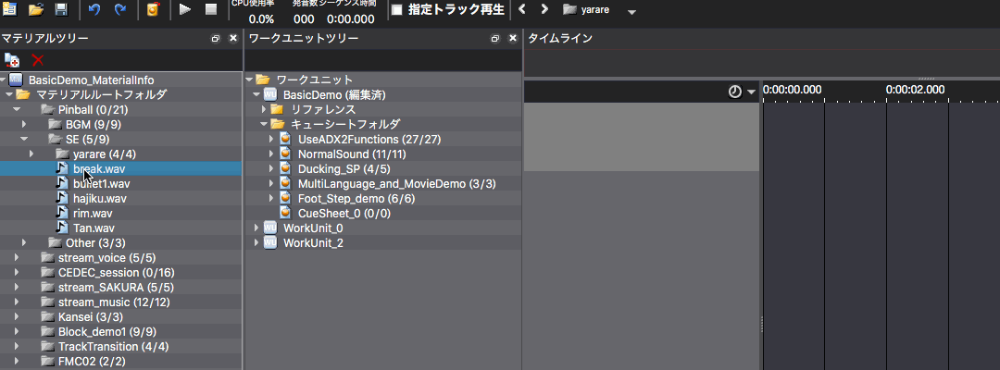
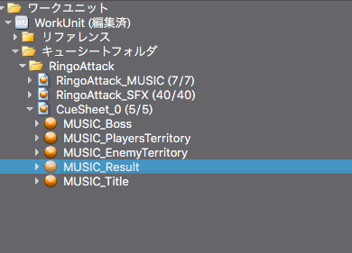

## ADX教程篇 Part 1：注册声音数据并在工具上播放

### 入门篇包括的内容
利用创作工具用来注册声音数据，进行最低限度的设置，并创建数据，交给程序员（实装到游戏中）。

### 注册步骤
1. 准备好声音数据
2. 拖放到素材树中
3. 拖放到WorkUnit的CueSheet中，创建一个Cue

注册材料时，建议按类型将其分为不同文件夹，如BGM和SE，并注册每个文件夹。 对于角色的声音，使用/VOICE/角色名称（或编号）/各种声音文件等，以方便管理。

从材料树中拖放多个文件到工作单元树时，会创建一个与文件名相同的Cue。

注意，如果拖放目的位置不在CueSheet上，将生成多个CueSheet。

即使是不小心弄错了，也可以撤销（Ctrl + Z）。

#### 补充
* 拖放创建Cue时，它是以波形数据的名称生成的（之后可以用F2键改变）

* 在游戏程序中“根据Cue名称播放”
* 因此，有一个好的波形文件命名规则是很有用的  
* 选择一个Cue，按F5播放，按F6停止播放