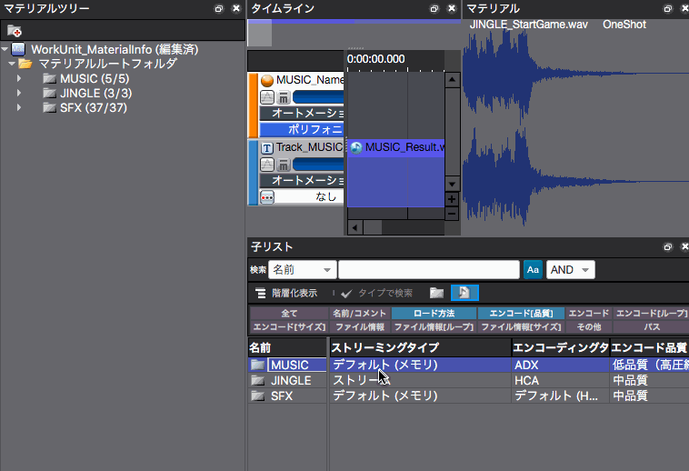
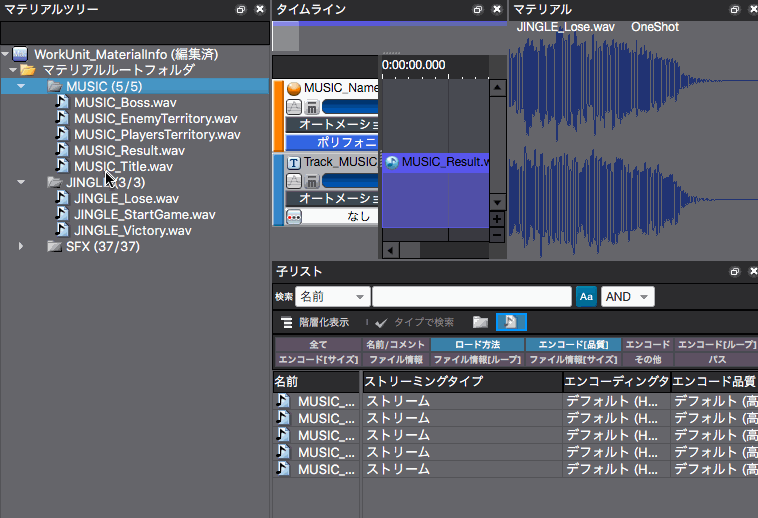

## ADX教程篇 Part 2：压缩设置、流播放设置

### 压缩的设置
1. 为了对素材树文件夹下的所有文件进行共同设置，先选择素材根目录
2. 根据情况从下拉菜单中改变子列表的流播放类型、编码类型和编码质量
3. 除了对每个文件夹进行批量设置外，还可以对文件夹下的每个文件进行单独设置

可以对文件夹和下面的文件夹进行批量设置。 在大多数情况下，BGM系选择流播放，Jingle系等时间很重要的音频选择内存或零延迟流播放，SE系选择内存，VOICE系选择流播放。默认的编码类型是HCA。编码质量在默认情况下是高，但通常可以边听边降低质量。

### 流播放的设置
设置是否从存储空间进行流播放。

内存播放将音频数据放在内存中进行播放，处理的声音越多，使用的内存就越多。为了减少使用量，BGM和长台词经常使用流播放。

也可以忽略树的父方的设置，对素材进行单独设置。增加这些就算是音质下降也没有关系的素材的压缩率，这在想要减少总容量时很有帮助。