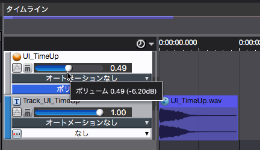
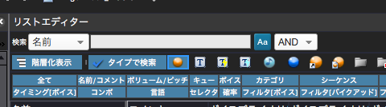
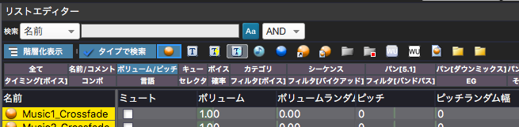
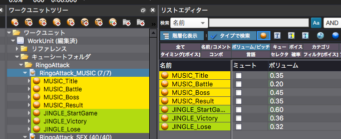

## ADX教程篇 Part 3：音量的设定

### 可以在多处设定音量
在下图中，有两个可以设置音量的地方，并且还有其他地方可以设置音量，但我们建议你把注意力放在最上面的滑条。

如果你在各种地方都对音量进行了设置，在以后自己回顾数据，或他人接触数据时，将很难找到设置点，所以我们不建议在Cue之外设置音量，除非是为了微调。

当一个Cue中有多条音轨时，一般可以用音轨侧的音量调整平衡。 在这种情况下，Cue侧的音量可以在同时保持多个音轨的音量平衡下，调整与其他Cue的平衡。

#### 如果在多个地方设定了音量
最终的音量将是所有设定值相乘的结果。如果设定了0.5和0.5的话，最后的音量将是0.25。

### 如需批量更改多个Cue的音量
首先，按Ctrl+4（Mac上为Command+4），进入布局4，列表编辑模式。

然后，由于列表编辑器在默认状态下显示了太多的项目，点击“全部”标签，关闭所有项目的显示，然后只打开 “音量/音高”标签，如下图所示。

这时，在工作单元树中选择一个CueSheet，会显示该CueSheet中所包含的Cue的音量信息列表。 也可以在这个列表中改变数值。

滑条只允许设置0和1.0之间的数值，但在列表中最多可以设置为5.0。这使得它可以很容易地处理音量过低的素材，而不必返回波形编辑器。