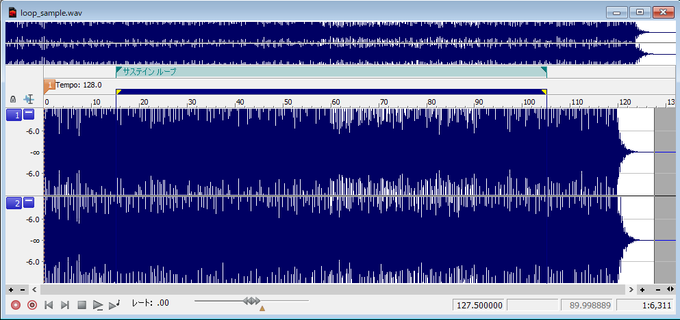
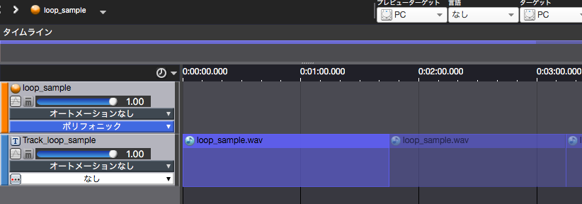
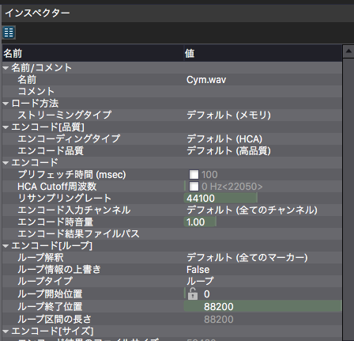

## ADX教程篇 Part 4：乐曲的Loop设定

游戏音乐和环境音效经常需要重复播放，让我们看看如何使用ADX2实现上述的循环播放效果。

### 波形数据中包括循环标记时
如果使用外部波形编辑软件（如SoundForge等）创建了一个循环，只需将其加载到AtomCraft中，循环就会发挥作用。

使用SoundForge将一首乐曲的重复部分设置为循环的截图。 如果是有前奏的循环乐曲，可以按图上方法设置。
因为它能如实反映声音数据制作者的意图，这是我们最推荐的方法。

将数据放在Cue的时间线上，它的循环被直观地显示出来。

当播放这个Cue时，它将持续播放，直到用户发出停止命令。 如果发音数有限制，它可能会随着之后播放的另一个声音而消失。

### 在AtomCraft上指定一个循环
双击素材树上想要设置循环的波形数据，显示检查器窗口。

在编码（Loop）下，将 "覆盖循环信息 "指定为 "True"，并以采样单位指定Loop开始和结束位置。

### 其他方法
#### 当为一个Cue设置循环时
循环标记可以放在时间轴上，而不是放在波形数据上，但由于指定的时间单位是毫秒，而不是样本单位，不适合于创建干净的乐曲循环。

#### 区域的自动重复功能
可以对排列在时间线上的波形（波形区域）进行设置。单位为毫秒。 这个功能适合于环境声音的制作，因为它允许重复播放的时间的随机化。