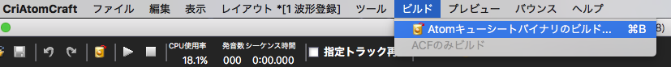
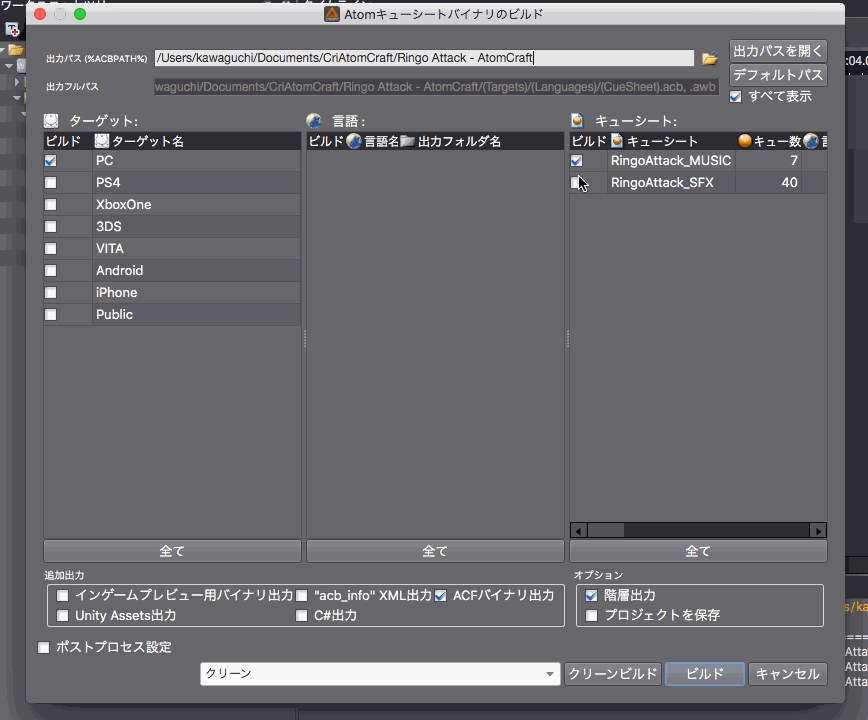
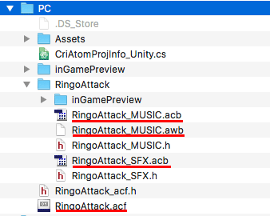

## ADX教程篇 Part 5：游戏用数据导出（构建）

### 数据导出
在Build菜单中选择Build Atom CueSheet二进制文件。

除非是主机游戏，目标只勾选PC也没有问题。LE用户的话可以选择Public。如果没有特别设定语言，就不会出现语言选项。

在最右边的CueSheet复选框中选择你要输出的数据，然后按Build按钮开始数据构建。

### 关于要传递给程序的数据的说明
如果按照上面的GIF动画来设定文件的导出，它们将会以下列文件结构导出。 其中，需要实际导入游戏引擎的数据有三种扩展类型：acf、acb和awb， 在下图中以红线勾出。

以上就是入门篇的内容，关于在Unity和UE4中播放声音的部分将在后面介绍。