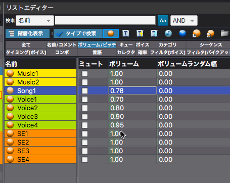
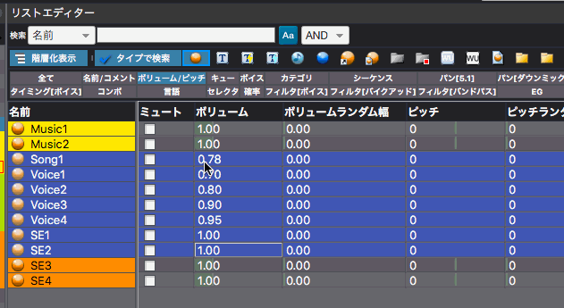

## ADX教程篇 Part 6：音量的批量设置

### 批量设置多个Cue的音量
这种方法不仅可以用于音量，也可以用于列表编辑器中的所有数值参数。

按住Shift键或Ctrl键（Mac上为Command键），同时进行多项选择，然后在想要改变的参数上点击右键，改变数值，这样所有选中的项目都会变成相同的值。

### 将数据复制并粘贴到电子表格中
单击“将所选单元格的内容复制到剪贴板”，可以直接粘贴到Excel的表格中。

### 在保留相对音量的前提下改变整体的音量
通过上述方式将数据复制到表格软件后，将所有单元格乘以相同的值，然后单击“将剪贴板上的内容粘贴到选定的单元格中”，将计算的结果复制到列表编辑器中。