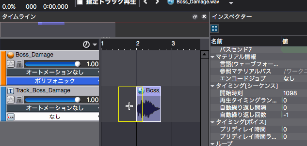

## ADX教程篇 Part 7：时间调整

### 使声音的时间与画面相契合
想要改变调用Cue的时间时，有一种方法可以改变Atomcraft上的Cue被调用和声音发音之间的时间。

### 在时间线上移动波形
为了方便编辑，将屏幕布局切换到[3.编辑参数]，如下所示。

时间线和检视器会并排在一起。选择想改变其位置的Cue的波形，会发现在检视器的中间有一个叫做“Timing [序列]->开始时间”的参数。(注意，当选择一个Cue或音轨时，这个参数不会显示)

移动波形，或者直接输入开始时间值来设置时间。

另外还可以在播放视频时匹配声音。

### 即使如此声音有时还是不能契合
主要原因是设备播放延迟的问题。

截至2018年10月，安卓系统的发音时间存在较大的设备差异。

安卓系统有一个低延迟的播放模式。要使用它会有一些限制，但当它用于需要快速反应的声音时（如音乐游戏中的敲击声）是有效的。详细情况将在之后说明。