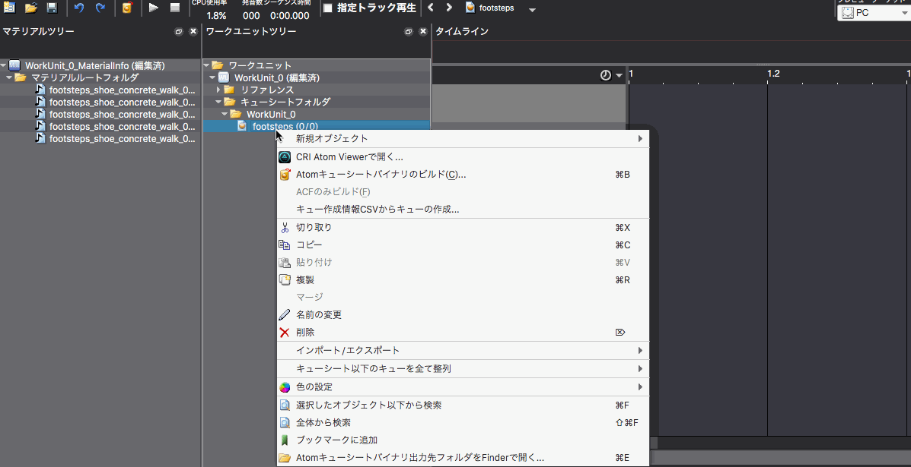
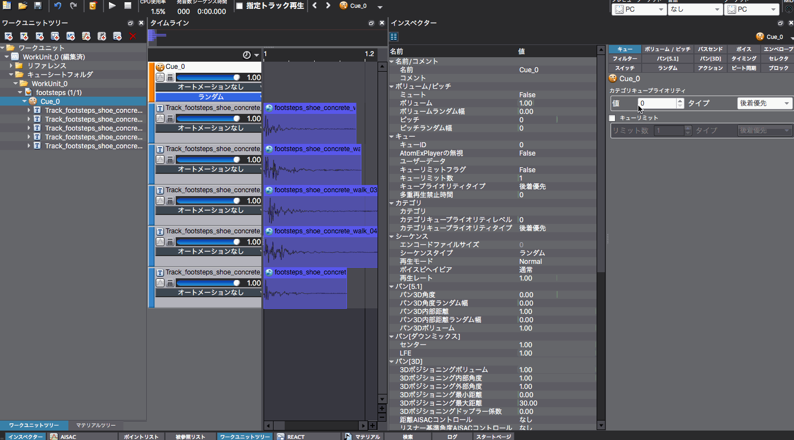

## ADX教程篇 Part 8：随机播放

### 随机播放的应用场景
随机播放通常用于“需要有多种反应的人物”，或用于“脚步声”或“枪声”这种同一声音反复听起来很单调的声音。

每次调用Cue时，系统都会播放Cue中注册的某一个声音。

在上面的GIF中，我们在CueSheet的右键菜单中选择“创建Cue”->“随机”，创建一个名为Cue_0的随机Cue。

从素材树中选择5个文件，并将它们拖放到Cue_0完成。

在GIF最后显示的菜单中，可以改变Cue的类型。

### 什么是随机不重复？
在随机不重复的情况下，在下一次随机抽选时，上一个播放的声音会被排除。

这意味着同一个声音不会被连续选择两次。 相反，在随机的情况下，同一个声音可能会被连续播放两次或多次。 请根据情况使用不同的类型。

这一功能的主要好处是：
* 程序员只需要调用一个Cue
* 通过增加或减少音轨的数量，可以增加或减少随机候选声音的数量（这是很常见的情况）
* 每条音轨被调用的概率（随机权重）可以轻松调整

将屏幕布局切换到[3.编辑参数]后，在检查器标签中选择随机。

检视器列表菜单被关闭，之后可以通过鼠标拖动（向上/向下）来改变五种声音的随机概率。

在这种情况下，第一个和最后一个声音被更频繁地调用，而中间的三个声音的演奏概率较低。也可以直接改变数值来变更概率。