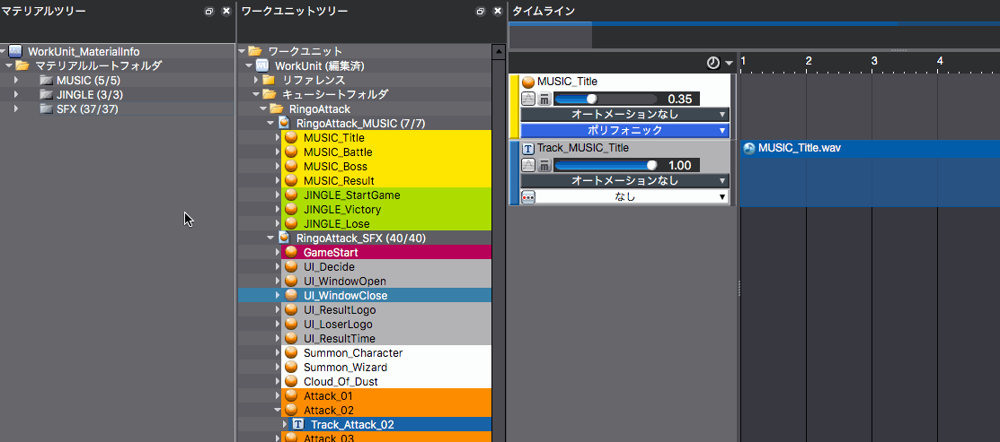
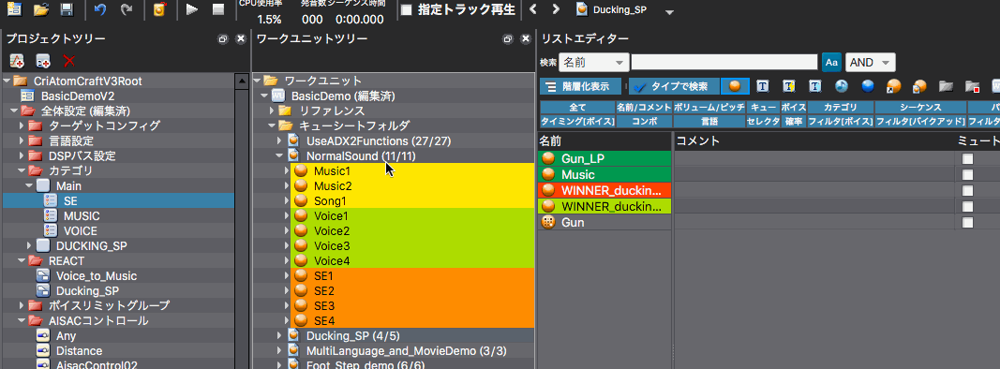

## ADX教程篇 Part 9：类别设定

### 创建类别&注册Cue
将WorkUnit树中的一个Cue拖动到项目树中的一个类别。

```
类别
　└类别组
　　　├MUSIC
　　　├SFX　　　　←拖到这里来
　　　├VOICE
```

#### 类别REACT编辑模式
将屏幕布局改为[6.类别REACT编辑]，在项目树中添加一个新的类别。

通过改变类别名称和从WorkUnit树上拖放Cue，可以将这些Cue注册在类别中。

也可以双击类别名称，打开被参照列表，查看该类别中已注册的Cue。



#### 在列表编辑模式下注册一个类别
在列表视图的类别栏中调出并选择类别编辑窗口



在WorkUnit树中选择CueSheet，在列表编辑器的“视图”标签中关闭“全部”并显示“类别”。 在类别栏中选择多个Cue，双击或使用回车键，调出类别选择窗口，勾选类别的复选按钮。