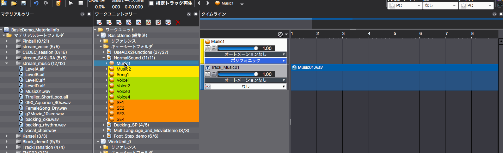
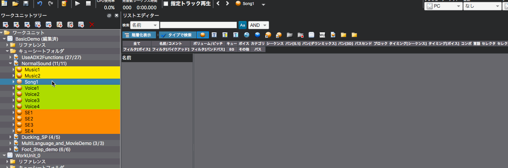
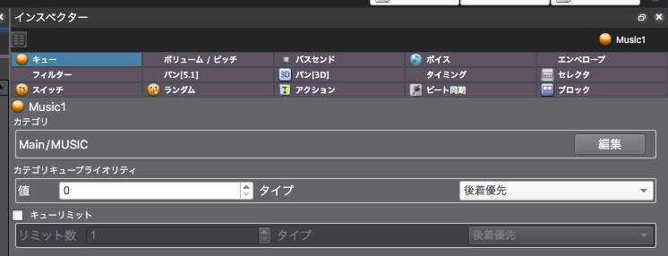
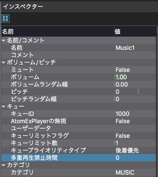

## ADX教程篇 Part 10：Cue的限制、优先权和多重播放禁止时间

让我们试着控制同时播放的声音数量。

◆ Cue限制。

指定同时可以播放多少个相同的Cue。

当超过限制时，从最先生成的声音开始停止播放，优先满足后来的请求。 相反，如果优先满足先到的请求，后来的请求会被忽略。

◆ 类别中的Cue的优先级

这是在前面指定的类别中的Cue限制的优先级。0-255，数字越大，优先级越高。

◆ 多重播放的禁止时间

当在设定的时间内请求播放同一个Cue时，废弃该请求。

需要进行声音限制的案例将另外总结。

### 设置Cue的限制
设置Cue的同时发声数量。

#### 在参数编辑模式下
将屏幕布局改为[3.参数编辑]，并在检视器中设置Cue Limit。

#### 在列表编辑模式下
将屏幕布局改为[4.列表编辑]，这里只显示标签中的Cue。

### 类别Cue优先级
前面提到过，0~255的数值越高，优先级就越高。 数值越大，比先到和后到的Cue的优先权就越高。 (即使先到的Cue有优先权，如果后到的声音优先级数值越大，也会优先播放。)

### 多重播放禁止时间
在检视器内选中Cue。值的单位是毫秒。

