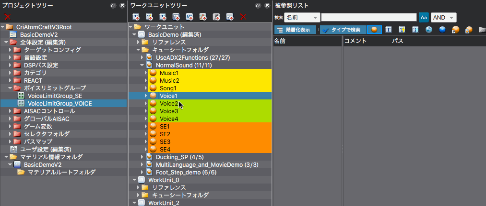
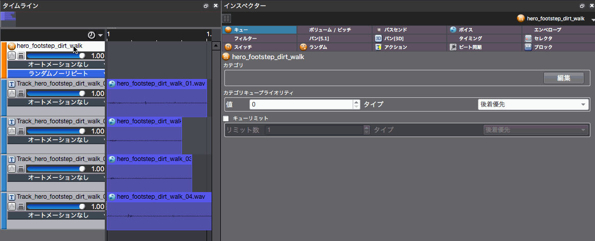

## ADX教程篇 Part 11：发声限制组

### 与Cue限制和类别Cue限制的差异
它不是一个针对Cue的发音限制，而是一个适用于Cue中包含的波形文件的发音限制。

```
CueSheet
　└Cue
　　└音轨
　　　└波形文件　←发声限制与这个有关
```
即使没有达到最大的Cue发音数，当达到声音发声数的上限时，也会被限制。

### 设定方法
右键点击项目树中的发声限制组以创建一个新的组，或从WorkUnit树中拖放一个Cue并注册。

#### 从WorkUnit批量注册一个组
注册Cue的时候，实际上注册的是该Cue包含的波形文件。

仔细查看图标的话，虽然我们尝试着注册橙色圆形图标的Cue，但列表中显示的是蓝色八分音符图标的波形文件。



#### 波形文件的个别设定
当选中了一个Cue时，Voice标签是灰色的，但当选中了一个波形文件时就可以编辑。



### 使用案例
例如，在射击游戏中，如果把声音分成两组，如“我方射出的子弹的发声组”和 “敌人爆炸的发声组”，就可以防止在收到大量的发音请求时，完全失去其中一个的情况。