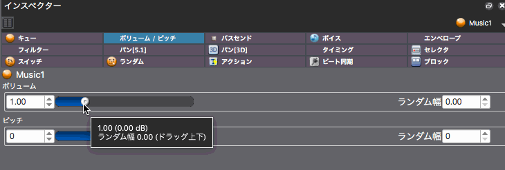
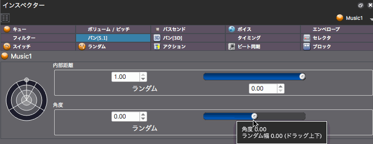

## ADX教程篇 Part 12：随机音高，音量和Pan

各种参数的设定基本会在布局[3.参数编辑]模式下进行，操作说明主要集中在检视器的GUI部分。

### 建议在Cue上进行设定
以下所有的设定也可以对Cue下面的音轨和波形文件进行，但基本上建议在选择Cue的情况下进行。

一个Cue中有多个音轨，如果我们想为每个音轨进行随机设定，就需要对每个音轨这样做。 此外，如果每个层级都设定了数值，输出结果将是所有数值相乘的结果。

### 音高和音量的随机设定
向上或向下拖动滑块来调整随机的幅度，也可以直接输入数值。

用途是多种多样的，但对动作元素中经常播放的声音（如脚步声、枪声等）的变化很有效。

### Pan的随机设定
与音高和音量一样，可以设置一个随机幅度。

这里设置的Pan是指在360°的水平方向上，听到声音的方位。

请注意，该设定在波形方面对具有3D定位的音源无效。 

