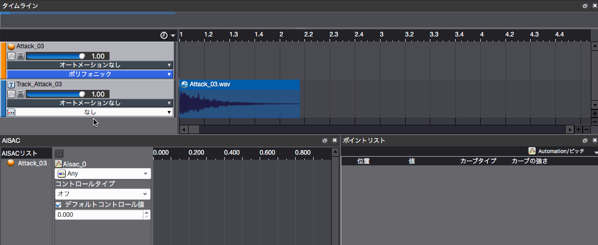

## ADX教程篇 Part 13：自动化
任何接触过DAW的人都对自动化有一定了解。它可以增加现有音效的变化。关于编辑时的布局，我们推荐使用[7 AISAC编辑]或[8 MA]或者其它显示点列表的布局。

除了音量、音高和Pan的变化，还可以改变滤波器和BusSend值，以实现各种效果。

### 自动化实现
用在时间线上画折线图的方式添加点。

也可以在点列表一侧输入数值。

点击“无自动化”，从“添加”中选择各种参数。

时间线上会出现一条直线，点击这条直线可以添加一个点。 可以拖动点来改变位置。

曲线类型可以从点列表中选择。如果选择了直线以外的选项，在曲线的中心会出现一个新的点，可以在这里调整“曲线强度”。 向上和向下拖动可以改变曲线的斜率。

可以在同一音轨上编写多参数自动化。