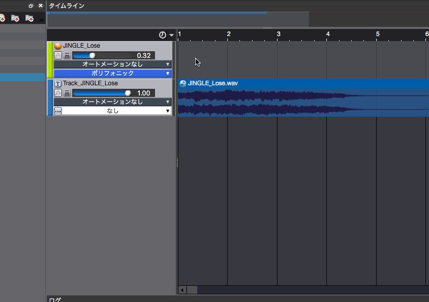

## ADX教程篇 Part 14：标记

### 标记的作用
◆ 控制播放位置

指定序列的开始、循环和结束。可以指定循环次数。可以从时间线的中间开始播放。

◆ 加入回调

在播放Cue的时候，程序可以检测到回调标记是否被通过，并可以通过指定ID和标签来获得一个特定的值。

◆ REACT的序列结束

从REACT效果（如躲避）中返回的时间本来是在Cue的末尾，但也可以从这个标记的位置开始返回。

### 在时间轴上打一个标记

从时间线的Cue区域的右键菜单中选择创建标记。

右键单击已创建的标记来编辑它。标记的位置可以拖动，也可以在编辑器上以毫秒为单位输入数值。

