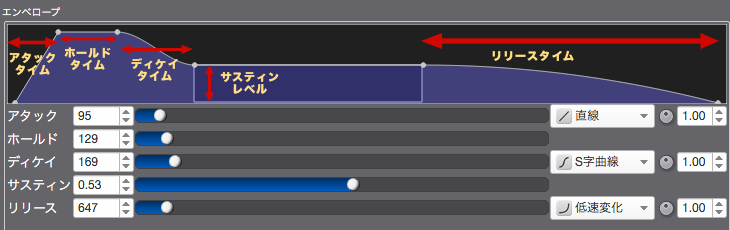
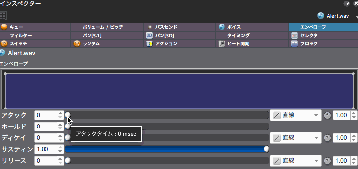
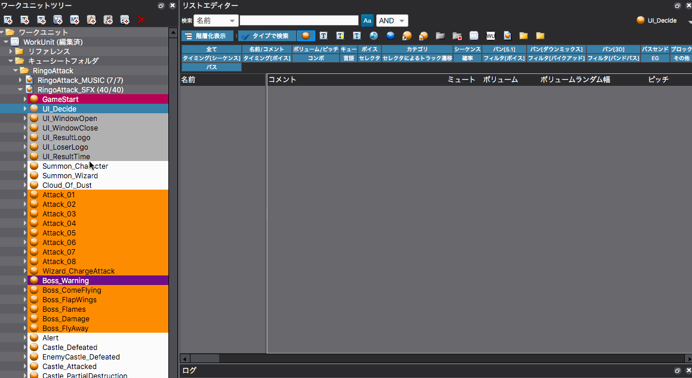

## ADX教程篇 Part 15：包络

### ADX2中的包络
时间轴上的音量变化的ADSR参数在合成器上是很常见的，但ADX2增加了保持时间。

这些都是设定在注册的波形文件上的。（当选择Cue或音轨时，会显示不可编辑）

各自的参数和音量变化见下图。时间的单位是毫秒，1.0是100%。

### 在GUI中的设定
将检视器显示改为包络并进行设定。

### 在列表编辑器中进行设定
在[4 列表编辑器]模式下，从WorkUnit树中选择一个CueSheet。

改变检视器中的类型搜索图标，使其只显示波形文件。之后选择标签EG，只显示包络。

