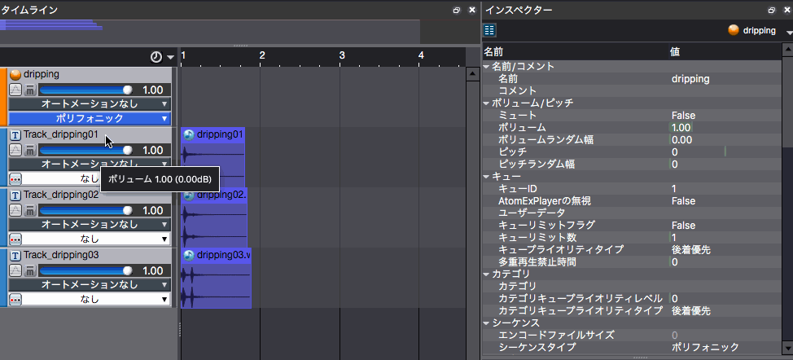
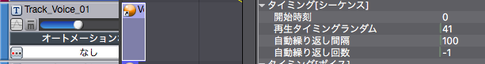
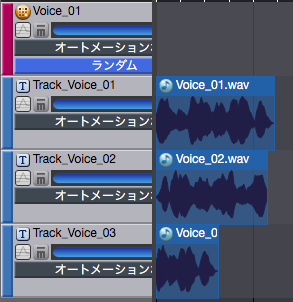
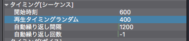

## ADX教程篇 Part 16：自动重复和随机偏移

### 波形的自动重复
波形区域是在素材被注册到Cue中时创建的，它有一个自动重复的设置，可以在检视器中进行设定。

播放时间、随机播放时间和自动重复时间间隔的单位是毫秒。重复的次数可以设置为-1，即无限重复。

上面显示了三种不同的水滴声的自动重复，并尝试着创造出了一种有水滴的洞穴的环境声。

### Cue的自动重复
Cue没有重复播放的设置，但能够对CueLink（当播放一个Cue时能够播放其他的Cue）进行设定。

如果CueLink的Cue被设置为随机播放，如下图所示，任意一个声音将以CueLink中指定的自动重复时间播放。

### 随机播放时间
在播放气氛声音和环境音时，与其以相等的间隔重复相同的声音，不如每次都有稍微不同的变化，使其更有个性，不那么枯燥。因此，我们可以试着让重复播放的时间每次往前或者往后偏移一点。

通过将Cue的音调、音量和Pan随机化，再加上将播放概率设置为小于100%，我们可以设计出更加丰富的声音。

