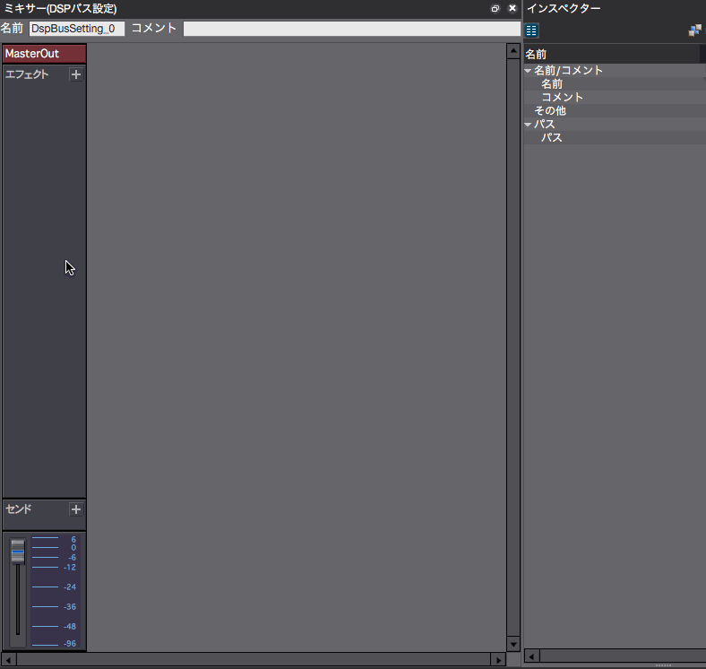
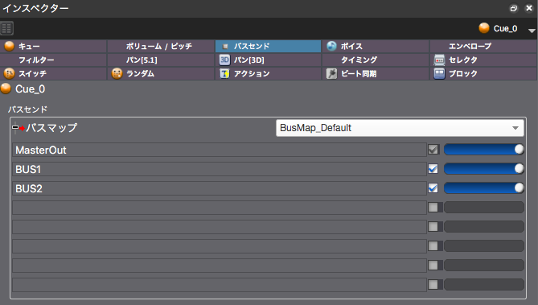

## ADX教程篇 Part 17：DSP总线（混音器）和效果器的追加

### 关于混音
与一般的DAW类似，这里是创建声音流动，把声音放在一起，用效果器进行设计的地方。

一旦Cue被分配到不同的BUS，它们就会被统一进行效果处理，然后合成到MasterOut中，形成最终的声音。

默认情况下只提供了MasterOut，所以需要增加BUS的数量。将布局切到[5 混音器]。

注意，如果没有正确指定输出目的地，即使电平表摆动，也不会有声音产生。 在上面的例子中，一个压缩器被添加到Master，一个混响被添加到BUS1，一个压缩器被添加到BUS2。

发送到BUS2的声音被压缩并与发送到BUS1的声音相结合，经过混响后与发送到MasterOut的声音相结合，最终将经过压缩器的声音播放出来。

### 从Cue到DSP总线的声音输出
在检视器的总线发送显示中指定从Cue发送到每个总线的音量，如下所示。编辑总线图的方法详见下一节。

