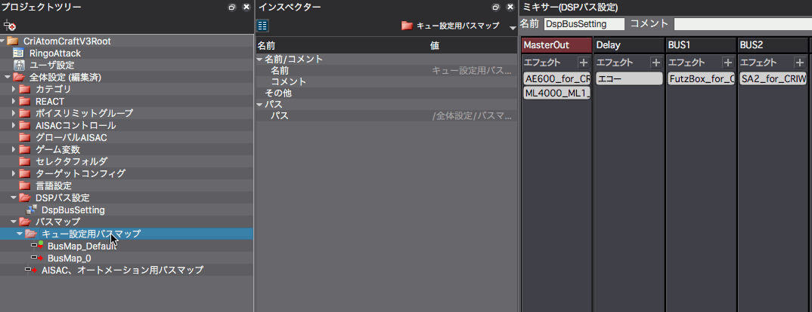
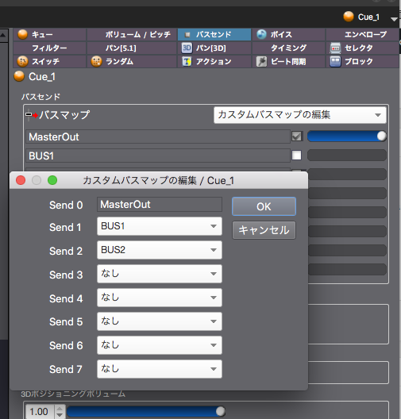

## ADX教程篇 Part 18：总线图

将各种Cue发送到上一节（17/DSP总线设置）中设置的DSP总线上的方法。

### 什么是Cue设置用的总线图？
ADX2最多可以创建64个总线，一个Cue最多可以同时被8个总线（1个Master和7个BUS）处理。
决定使用哪8条总线的功能被称为总线图。

### 什么是AISAC和自动化的总线图？
从字面上看，它是一个可以由AISAC（将在上级篇介绍）和Automation（教程第13节）处理的总线图，而且项目中只存在一个。

### 什么是自定义总线图？
一个针对Cue的总线图。如果想对其他Cue使用类似的设置，请使用上述Cue设置用的总线图。

