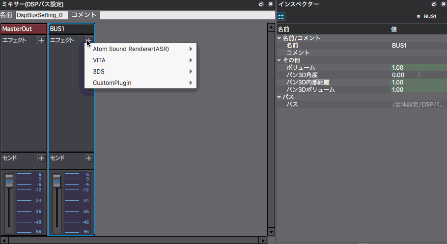
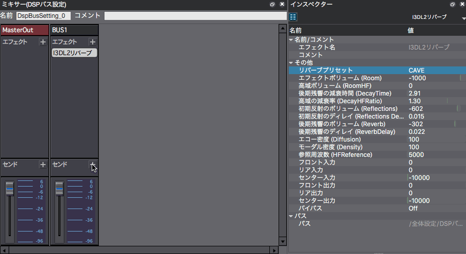

## ADX教程篇 Part 19：混响

### 用于浴室和山洞等场景的效果
混响效果被称为Reverb：在DSP总线（<a href="ADX_Part_17.md" target="_blank">中级篇17 DSP总线（混音器）和效果器的追加</a>）设置里选择I3DL2混响。

如果混响效果应用于MasterOut，它将会对其他声音（如音乐）产生混响，所以一般建议将它应用于其中一个BUS。

### 检查BUS输出目的地
如果BUS输出没有被送到MasterOut，就不会有声音，请注意这一点。

### 设置有点困难？
因为参数相当多，所以很难全部设定。总之可以先使用预设。

先找到一个感觉相近的，然后一点一点地调整参数，看看有什么变化，让声音更接近印象中的效果。