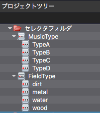
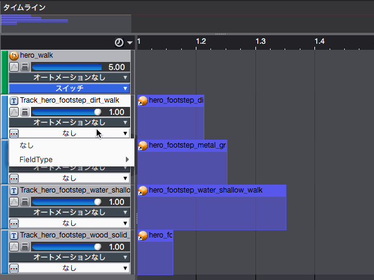
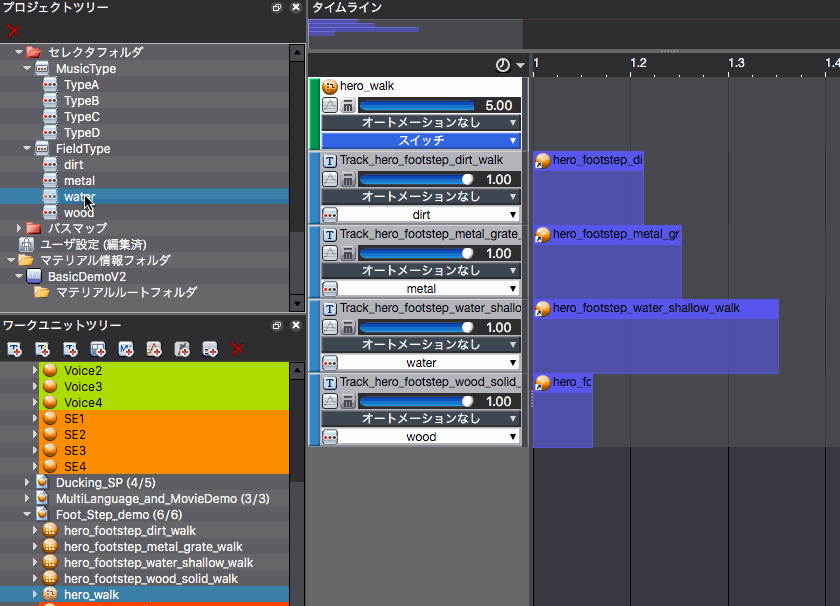
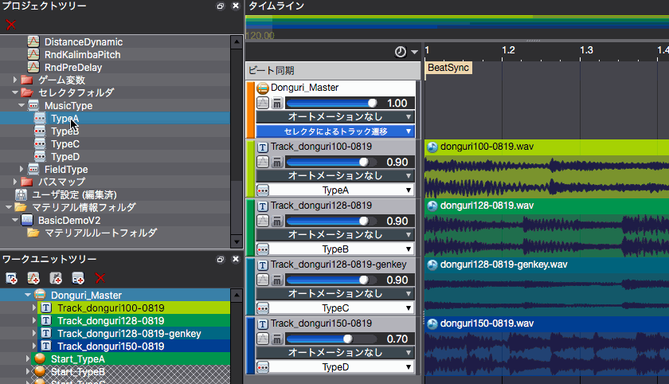

## ADX教程篇 Part 20：选择器

### 提供选择器和选择器标签
一个选择器可以有多个选择器标签。

创建它们的方法与类别相同，从项目树上的右键菜单中选择。

这里提供了在之前的例子中，分别用于在乐曲之间切换和改变脚步的标签。

### 根据指定的选择器标签，能发出不同声音的Cue
#### 根据地面素材改变脚步声的例子
从CueSheet中创建一个新的“切换”Cue，准备多个音轨，并为每个音轨选择一个选择器标签。

#### 关于上述案例的预览
每次选择一个选择器标签时，我们可以看到在时间线上回放的音轨（出现绿色指示灯的音轨）是如何切换的。

### Tips
#### 使用选择器的音轨过渡功能
我们将在之后的教程中提供一个对音轨进行交互式变更的例子。

