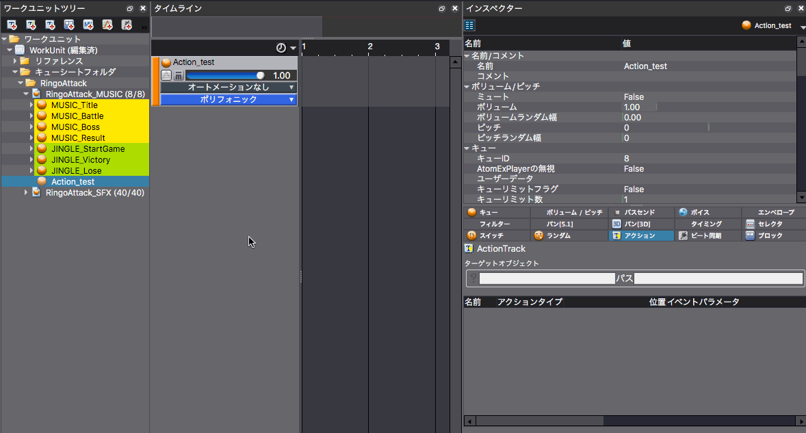

## ADX教程篇 Part 21：Action功能
### 可以干涉Cue和类别
可以在一个指定的Cue或类别上加上各种Action。
* 在Cue的时间线上创建一个Action音轨
* 拖动Action音轨上的一个目标Cue或类别
* 在Action音轨上添加Action

例如，在播放特定的音效时，可以对乐曲进行“开始播放”、“停止”、“暂停”、“恢复”、“切换选择器”、“静音、取消静音”、“改变音量”和“改变音调”等演出效果。

### Tips
#### 可以创建仅有Action的Cue
