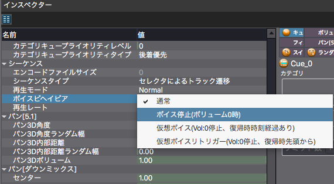

## ADX教程篇 Part 22：声音行为
设置当Cue音量为0时的声音行为。

该设定需要选定Cue之后在检视器上进行。

### 关于各个设定
#### 通常
当Cue音量为0时，继续播放声音。虽然听不到声音，但资源仍会被消耗。 如果在播放过程中再次提高音量，将会恢复播放。

#### 停止声音
当Cue音量为0时，停止播放声音并释放资源。这对于某些放置在游戏中，随着玩家距离增大时就听不见了的声音是有效的。

#### 虚拟声音（Vol：0停止，返回时经过了一段时间）
当音量为0时，声音资源被释放并自行切换到虚拟语音。

例如，如果有人在唱歌，当我们离得太远听不到时，声音就会被释放，再次靠近，声音再次响起时，就会恢复，好像这首歌已经持续了很久。

#### 虚拟声音触发（Vol：0停止，返回时从头开始）
当音量为0时，声音资源被释放并自行切换到虚拟语音。

这在某些场景时十分有效的，例如：在接近特定区域时开始播放的语音指引。

### 关于声音
欲了解更多信息，请见下文。（日文）

<a href="https://game.criware.jp/manual/adx2_tool/jpn/contents/criatom_tools_atomcraft_voice.html" target="_blank">CRI Atom Craft手册</a>

<a href="https://game.criware.jp/learn/glossary/#voice" target="_blank">ADX2用语集：声音</a>
