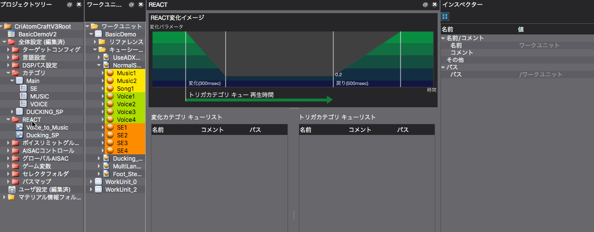

## ADX教程篇 Part 23：REACT躲避

### REACT是什么
REACT是一个功能，用来触发在某个类别中注册的Cue对另一个类别中的Cue的行动。

### 躲避是什么
在ADX2中，通过使用REACT功能可以很简单地进行躲避。
程序员所要做的就是调用一个Cue，ADX2会自动改变音量。音量变化的速度、曲线以及变化后的音量都可以在Atom Craft上设置。

以下是在屏幕布局6[类别REACT编辑]模式下进行的。

REACT的添加与类别和DSP总线设置的添加类似。

因为我们想在播放对话时降低BGM的音量，指定VOICE为触发器，MUSIC为改变类别。

触发Cue的播放后，BGM音量将在0.3秒内降至0.2，触发Cue停止后，BGM将在0.5秒内恢复到原来的音量。

基本上，短时间内把它调低，然后再慢慢调高，会降低违和感，但实际上的演出并不仅限于此。