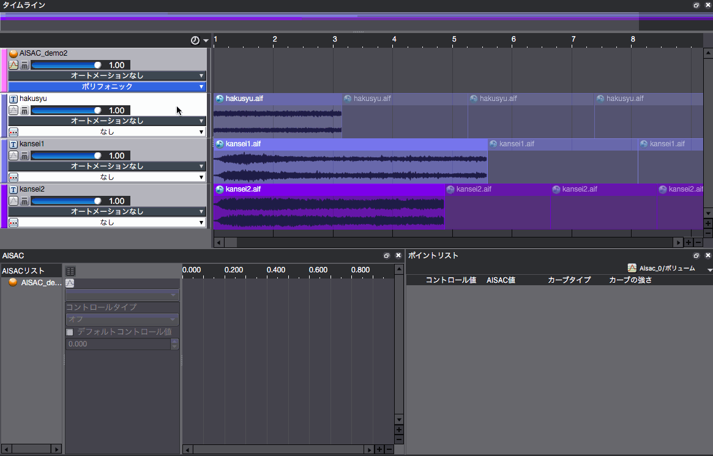
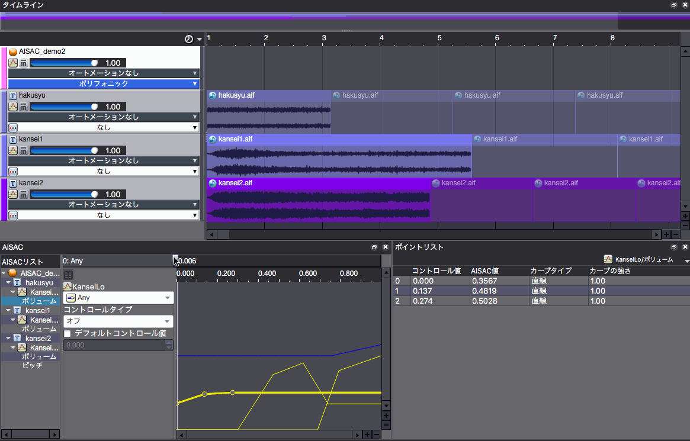
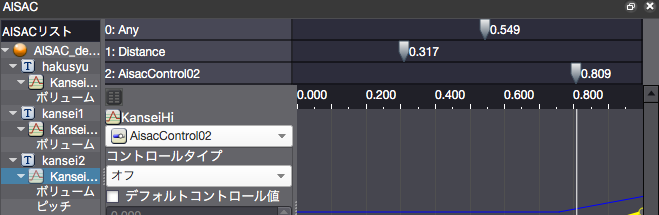

## ADX教程篇 Part 24：AISAC互动音效（欢呼声）演示

### AISAC是什么
[ADX2用语集：AISAC（日语）](https://game.criware.jp/learn/glossary/#aisac)

### AISAC的添加和编辑
在上面的例子中，我们为一个音轨创建了音量控制的AISAC。

通过右击Cue并调出右键菜单来创建一个挂在Cue上（针对所有音轨）的AISAC。

在AISAC列表中选中要编辑的AISAC，并点击黄线来添加一个点。创建一个音量变化。

然后，对于同一音轨，创建一个用于音高变化的AISAC，将折线的形状改为曲线，并通过向上或向下拖动出现在曲线中间的点来改变曲线的弧度。

三种类型的欢呼声被连续循环播放，并由AISAC改变音量平衡和音调以让演出更加兴奋。

底部中央的彩色线条图代表了声音的变化，而左右移动的滑块与上面演示中的滑块相对应。

### Tips
#### 使用多个AISAC控制
能够实现更加复杂的演出。

