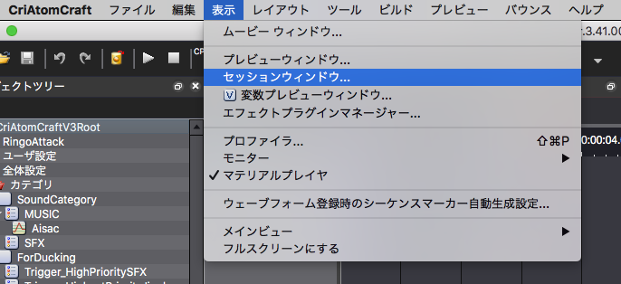
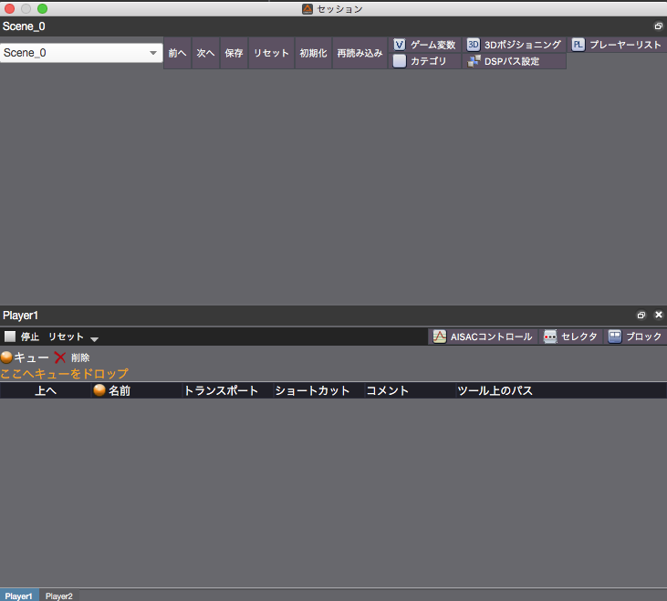
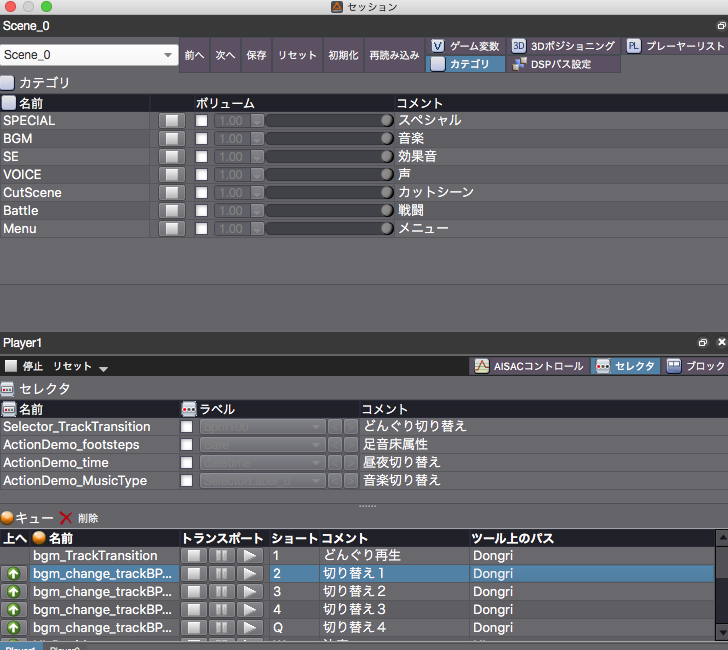
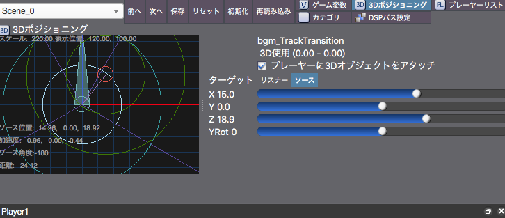

## ADX教程篇 Part 27：Session窗口

### 强大的预览功能
该功能可以在以下网页中找到具体的操作方法。

<a href="https://criware.info/session_window/" target="_blank">Session窗口的介绍（日文）</a>

### 操作方法
(1) 从菜单中选择Session窗口

(2) 将素材树窗口中的Cue拖到到标有“将Cue放在这里”的地方

(3) 注册了多个Cue后，就会显示类别和选择器。当Session窗口处于活动状态时，可以用快捷键发出注册的Cue。该窗口中的类别音量和其他设置独立于数据端，因此可以很容易地进行平衡调整。

(4) 使用3D定位预览Cue。如果选中复选框“将3D对象附加到播放器”，可以移动音源和听众的位置。在“目标”选项卡中选择声源或听众，拖动左边的同心圆，或移动右边的滑块，看看声音是如何被听到的。

