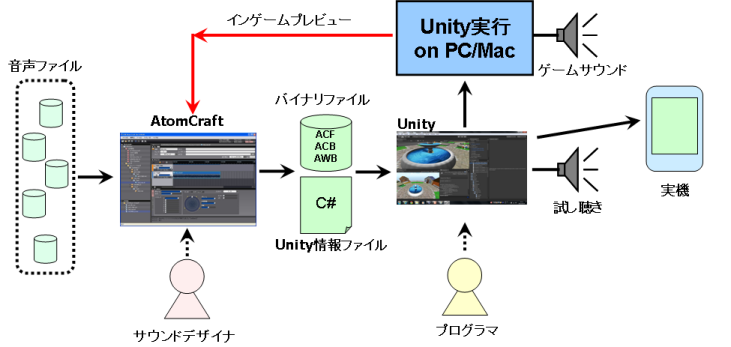

## 准备篇：CRIWARE Untiy插件的基础知识
### 什么是CRIWARE Unity插件？
CRIWARE Unity插件（以下简称CRIWARE插件）是在Unity上使用以下工具的插件：
* ADX2（音频播放的中间件）
* Sofdec2（视频播放的中间件）
* File Magic PRO (文件管理的中间件)

本教程将介绍在CRIWARE插件中，通过ADX2播放音频的规范步骤。

本节将主要介绍基本知识。如果你想了解实际的使用方法，可以跳过本节。

### 关于工作流程
用CRIWARE插件实现声音的工作流程如下图所示。

首先，以声音数据（WAV数据）的形式准备所需数量的音频材料。 
使用CRI Atom Craft创作工具为Unity构建CRI ADX2数据。 
将建立的声音数据导入Untiy项目。 
最后，通过对场景进行初始化设置并将用C#编写的类组件贴到游戏对象上，就可以进行声音播放。 
声音播放是通过CRI ADX2 C#封装API控制的。

### 相关链接
#### Atom Craft教程
关于CRI Atom Craft声音创作工具，有一个<a href="file:///D:\Github\blog_translation\ADX%20Tutorial\README.md" target="_blank">专门教程</a>。

#### 用语集
<a href="https://game.criware.jp/learn/glossary/" target="_blank">该页面</a>包含用于描述CRI产品的术语表。

### 关于用CRI Atom Craft建立的声音数据
当用CRI Atom Craft构建时，会产生一个“.acf ”文件和几个“.acb”和“.awb”文件。 
这些统称为声音数据。

#### 什么是ACF文件？
一个ACF文件是一个扩展名为acf的文件。 
该文件包含CRI Atom Craft中设置的类别分类、AISAC设置、总线设置等。

#### 什么是ACB文件？
ACB文件是一个扩展名为acb的文件。 
该文件包含CRI Atom Craft中创建的每个CueSheet的二进制信息。 
设置为“内存播放”的波形数据也被记录在这个文件中。

#### 什么是AWB文件？
一个AWB文件是一个扩展名为awb的文件。 
设置为“流播放”的波形数据被记录在这个文件中。

### Tips
#### 怎样才能了解更多关于用CRI Atom Craft建立的声音数据？
请参考SDK附带的手册中的以下章节： 
<a href="https://game.criware.jp/manual/adx2_tool/jpn/contents/criatom_tools_atomcraft_tutorial_build.html" target="_blank">创建ACB（CueSheet二进制文件）</a>
