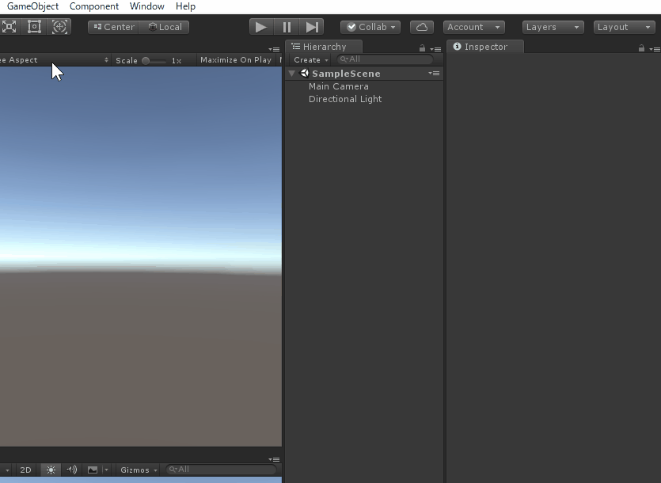
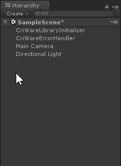
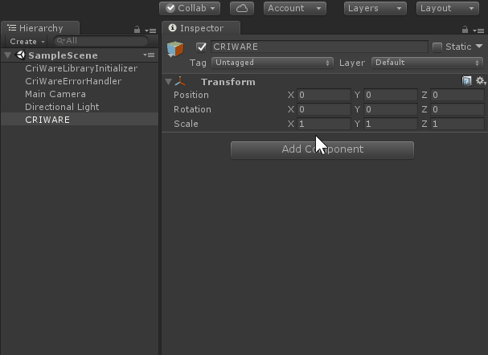
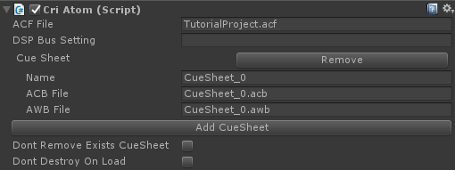

## 入门篇03：初始化设置的进行
准备好了声音数据之后，在Unity场景中配置CRIWARE Unity插件的初始化设置。

### 在场景中放置用于插件初始化的组件
如下面的视频中所示，从GameObject>CRIWARE菜单中创建一个包括这两个组件的GameObject。

#### CriWareInitializer
这个组件是用来初始化插件的。 
它必须放在场景中，以便CRIWARE插件能够工作。

#### CriWareErrorHandler
用于处理错误的组件。 
如果插件不能正常工作，错误信息会通过这个组件输出到Unity控制台。 
虽然它不是必需的，但在开发过程中非常有用，推荐放在场景中。

### 在场景中放置声音数据
为了播放声音，必须加载创建的声音数据。 
按照下面的步骤来放置组件，数据将在场景启动时被加载。

（1）创建一个空的GameObject。 在这里，我们将其命名为“CRIWARE”。

（2）将CriAtom组件添加到“CRIWARE”。

（3）在CriAtom组件中设置ACF文件名。 
（4）按下“Add Cue Sheet”按钮，指定CueSheet的名称、ACB文件和AWB文件（如果有的话）。

注意：
* 上面指定的“文件名”是指来自StreamingAssets文件夹的相对路径。把文件移到StreamingAssets正下方以外的其他位置时要小心。
* 如果没有重命名ACB/AWB文件，CueSheet的名称与这些文件名称相同。

通过以上步骤完成初始化设置。