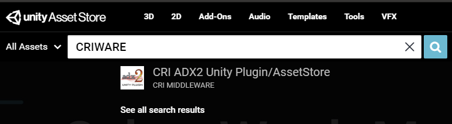
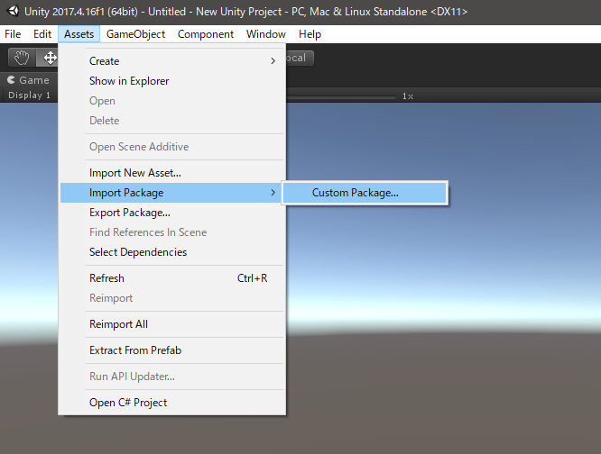
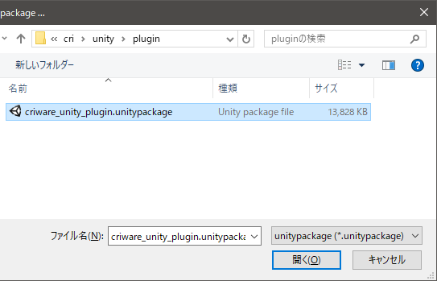
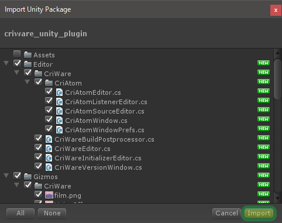
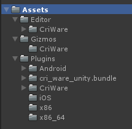

## 入门篇01：SDK的获取与导入
### 需要准备的东西
* Unity编辑器
  * 本教程是基于Unity 2017.4 LTS的。
  * CRIWARE插件可以在Unity 5或更高版本中工作。
* Unity项目
  * 请准备一个正在开发的项目或一个新的项目。
  * 在后面的章节中，将创建一个新项目来进行说明。
* CRIWARE插件
  * 可以通过以下方式获得它们。

### 如何获得CRIWARE的插件
#### LE版本（CRI ADX2 LE）
可以从以下页面下载： 
<a href="https://game.criware.jp/products/adx2-le/" target="_blank">https://game.criware.jp/products/adx2-le/</a>

#### UP版本（Unity资产商店版本）
购买页面：<a href="https://assetstore.unity.com/packages/tools/audio/cri-adx2-unity-plugin-assetstore-100086" target="_blank">https://assetstore.unity.com/packages/tools/audio/cri-adx2-unity-plugin-assetstore-100086</a>  
或者，在商店中搜索“CRIWARE”。

#### Pro版（CRI ADX2）
请使用以下表格与我们联系。 
试用申请表：<a href="http://www.cri-mw.co.jp/contact/game.html" target="_blank">http://www.cri-mw.co.jp/contact/game.html</a>

### Unity项目中的CRIWARE插件
#### LE版/Pro版（导入.unitypackage）
1. 解压缩文件并检查.unitypackage文件的位置（路径：cri\unity\plugin\criware_unity_plugin.unitypackage）
2. 从Unity编辑器菜单中，选择“Assets > Import Package > Custom Package...”。

3. 选择.unitypackage

4. 在Unity导入界面按“Import”。

通过上述步骤把CRI相关的文件放在资产文件夹下。

#### UP版
在Unity编辑器上，在资产商店的CRI插件产品屏幕上按“Download” => “Import”，然后按照上面LE和Pro版本的第四步进行操作。 
资产文件夹下的配置不同，但在操作上没有区别。

※关于创作工具（AtomCraft） 
CRIWARE插件播放的音频数据是用一个叫做CRI Atom Craft的创作工具创建的。 
对于LE/Pro版本，这包括在SDK包中，但对于UP版本，Unity资产商店中只有插件。 
不过，通过提供购买UP版本的证明（发票/收据），可以从以下支持网站下载。 
<a href="https://unityplugin.crimiddleware.com/" target="_blank">https://unityplugin.crimiddleware.com/</a>

