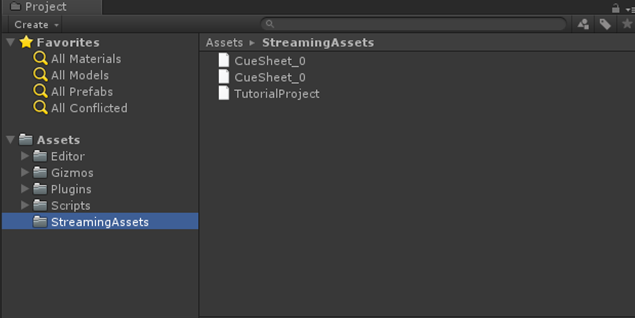

## 入门篇02：导入声音数据
为了使用CRIWARE插件播放声音文件，需要用CRI Atom Craft转换它们。 
本节将介绍如何将声音数据导入到Unity项目中。

### 准备声音数据
你是否想知道如何使用CRIWARE插件，但没有想要播放的特定声音文件？ 
如果是这样，请使用本教程的预置声音数据。

<a href="https://game.criware.jp/wp-content/uploads/2018/12/tutorial_introduction_Unity_lesson02.zip" target="_blank">tutorial_introduction_Unity_lesson02.zip</a>

本压缩包已经包含了ACF/ACB/AWB文件。

如果你想在CRIWARE插件中使用自己的声音文件，或者只是想试试CRI Atom Craft的效果，请参考以下链接中的声音数据转换说明。

这篇文章介绍了如何在Unity和CRI Atom Craft之间交换声音数据。 
<a href="https://game.criware.jp/learn/tutorial/unity/unity_extra_01/" target="_blank">番外篇：使用CRI Atom Craft为Unity创建声音数据</a>

### 在项目中放置声音数据
CRIWARE插件的基本使用方法，是将声音数据被放置在StreamingAssets文件夹中。 
创建一个如下所示的文件夹，并将文件放入其中。这样就完成了导入。

