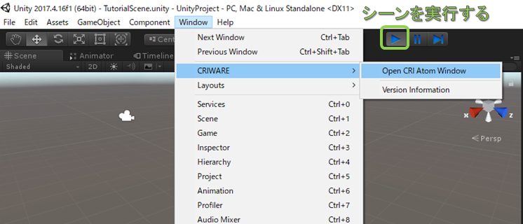
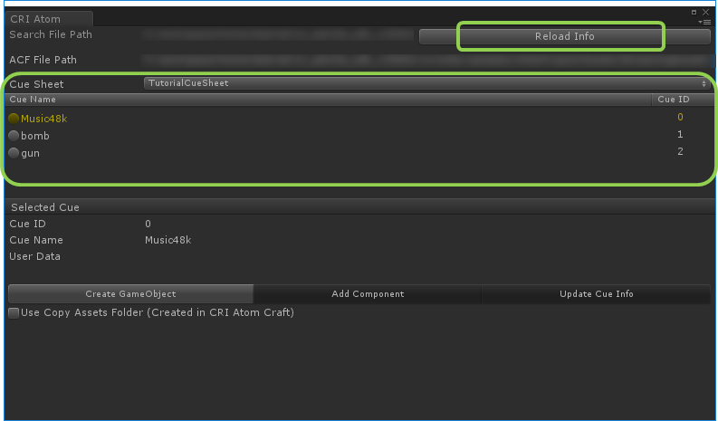
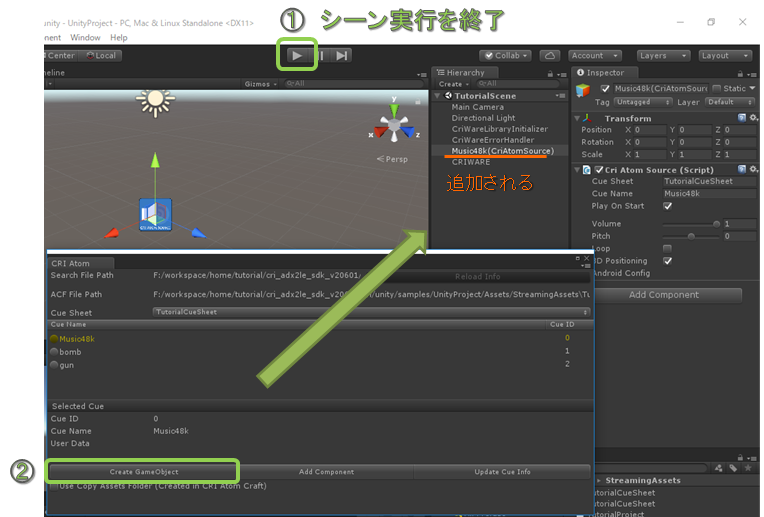
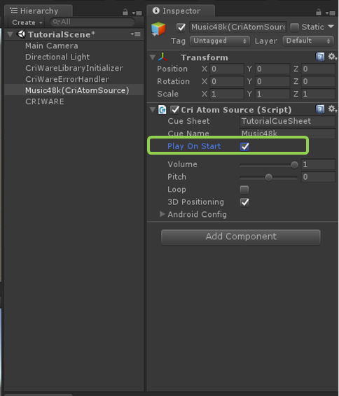

## 入门篇04：发出声音
现在让我们在场景中放置声音播放的组件。
本节描述了使用“CRI Atom Window”在场景中播放声音的步骤，你将检查CueSheet的内容并在Untiy Editor上放置声源。

### 确认CRI Atom Window中的Cue列表
从Windows>CRIWARE打开CRI Atom Window。 
打开后，运行CriWareInitalizer所在的场景。

在场景运行过程中按下“Reload Info”将显示Cue列表。 
显示时场景将停止运行。

### 在场景中添加一个用于音频播放的GameObject
现在让我们为场景添加BGM。 
从CRI Atom Window的Cue Sheet列表中选择想用于BGM的Cue。 
如果使用的是采样数据，请选择“Music48k”。 

选定之后，按[Create GameObject]。

这样就能看见一个附有CRI Atom Source，用于播放声音数据的GameObject被放置在了场景中。

### 在Unity Editor运行过程中进行播放
现在让我们在Unity中实际播放声音数据。 
勾选刚刚添加的GameObject的[Play On Start]属性。

这样运行场景时就会播放声音了。