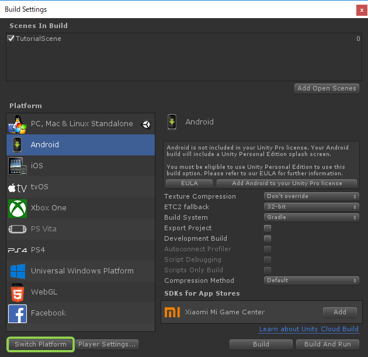
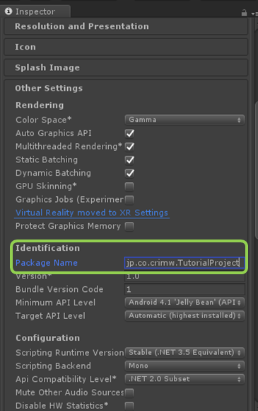

## 入门篇05：构建应用
本节将介绍在Unity中实际构建一个应用的步骤。

### 在构建之前
当使用CRIWARE插件的功能时，不需要为每个平台编写不同的程序。 
可以在Windows/Mac/Smartphone等设备上使用相同的代码。

然而，每个版本的CRIWARE插件所能建立的平台是不同的。 
例如，LE版支持Windows/Mac/iOS/Android四个平台。 
构建每个平台所需的库都位于Assets/Plugins中。

### 选择构建的平台
让我们尝试一下实际的构建。 
选择File>Build Settings。

可以在Build Settings窗口的左下角按[Switch Platform]来切换构建平台。

### 构建的方法
这一次，我们将为Android构建应用。
在“构建设置”窗口的“平台”字段中选择“Android”，然后按[Switch Platform]。

这时，如果Build Settings>Player Settings...>Identification>Package Name仍然是默认的[com.Company.ProductName]的话，请用[jp.co.crimw.TutorialProject]或类似的名称替换。

按[Build And Run]，在连接到PC的安卓设备上以调试模式启动它。 
这样就可以在实际设备上播放音频。