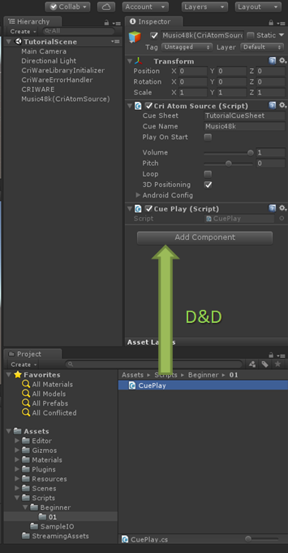
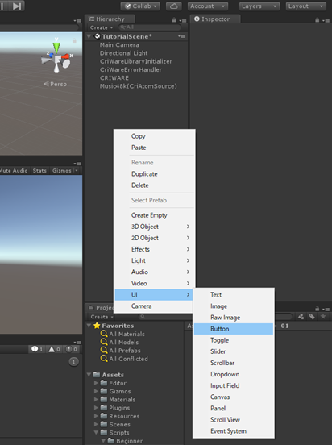
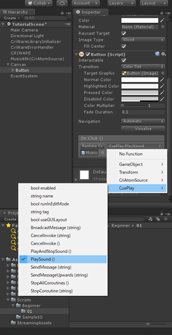
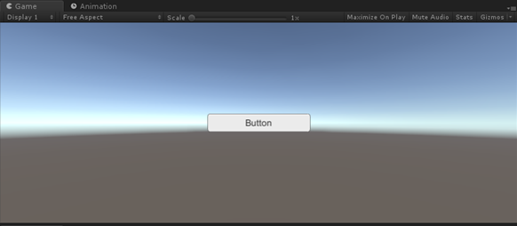
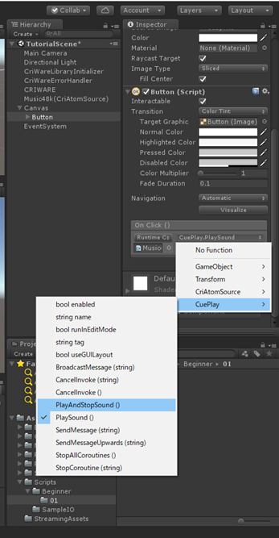

## 初级篇01：使用C#脚本播放声音

在入门篇中，我们看到了如何在编辑器中播放声音。<br/>
这一次，我们将使用一个脚本来控制声音。

### 添加一个脚本来控制声音的播放
我们在这里附上了示例代码。<br/>
将下载好的源代码导入到Unity项目中。

 <a href="code/CuePlay.cs" target="_blank">CuePlay.cs</a>

在“入门篇04”中，我们在场景中添加了带有[CRI Atom Source]组件的GameObject。<br/>
向这个GameObject添加脚本，如图所示。



接下来，点击[UI]→[Button]，将按钮追加到场景中。



将CuePlay类的PlaySound函数设置为添加的[Button]的OnClick回调。



运行场景并点击[Button]来播放声音。



### 防止多次播放
如果按照上述步骤操作，声音就会播放，但每一次点击按钮时都会触发播放。<br/>
为了防止多次播放，可以尝试使用脚本控制它。<br/>
通过检查ADX2的状态来停止正在播放的声音，方法如下。

```csharp
    public void PlayAndStopSound()
    {
        if (atomSrc != null) {
            CriAtomSource.Status status = atomSrc.status;
            if ((status == CriAtomSource.Status.Stop) || (status == CriAtomSource.Status.PlayEnd)) {
                atomSrc.Play();
            } else {
                atomSrc.Stop();
            }
        }
    }
```

将[Button]的OnClick回调改为CuePlay类的PlayAndStopSound函数。



点击[Button]，现在可以在播放时停止声音。


### Tips
#### 关于CriAtomSource的函数
CriAtomSource有多个控制播放的函数。
本教程中使用了以下两个。
* CriAtomSource::Play()
* CriAtomSource::Stop()

更多详情请参考我们的插件手册。
