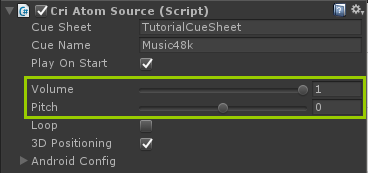

## 初级篇03：变更音量和音调
### 用CriAtomSource调整音量和音调
音量和音调可以在CriAtomSource组件的检视器中调整。



这两个滑条分别对应于以下CriAtomSource字段。<br/>
通过给这两个字段取值，可以从脚本中改变音量和音调。
* 音量: CriAtomSource.volume
* 音调: CriAtomSource.pitch

### 详细步骤
在上一篇中我们创建了一个播放声音的场景。<br/>
通过接下来描述的步骤，可以向这个场景添加功能，以直观地检查音量和音调的调整效果。

（1）首先，在场景中添加音量和音调调节滑块。 在这里，它们分别被称为VolumeSlider和PitchSlider。<br/>
（2）按以下方法调整每个滑块的数值。<br/>

|滑块| Min | Max |初始值|
|----|-----|-----|------|
|VolumeSlider|0|1|1|
|PitchSlider|-800|800|0|


（3）在“初级篇01”中使用的CuePlay.cs中添加滑块相关代码。

```csharp
public class CuePlay : MonoBehaviour
{
    /* 添加字段 */
    public UnityEngine.UI.Slider volSlider;
    public UnityEngine.UI.Slider pitchSlider;

    private CriAtomSource atomSrc;

    void Start() {
        atomSrc = (CriAtomSource)GetComponent("CriAtomSource");
    }

    public void PlaySound() {
        if (atomSrc != null) {
            atomSrc.Play();
        }
    }

    public void PlayAndStopSound()
    {
        if (atomSrc != null) {
            CriAtomSource.Status status = atomSrc.status;
            if ((status == CriAtomSource.Status.Stop) || (status == CriAtomSource.Status.PlayEnd)) {
                atomSrc.Play();
            } else {
                atomSrc.Stop();
            }
        }
    }

    /* 添加事件回调函数 */
    public void OnVolSliderChanged() {
        atomSrc.volume = volSlider.value;
    }

    public void OnPitchSliderChanged() {
        atomSrc.pitch = pitchSlider.value;
    }
}
```
在Unity编辑器中指定检视器上的每个滑块。


（4）将之前添加的函数设置为每个滑块的OnValueChanged事件。


现在可以在播放开始后用滑块检查音量和音调的调整效果。


