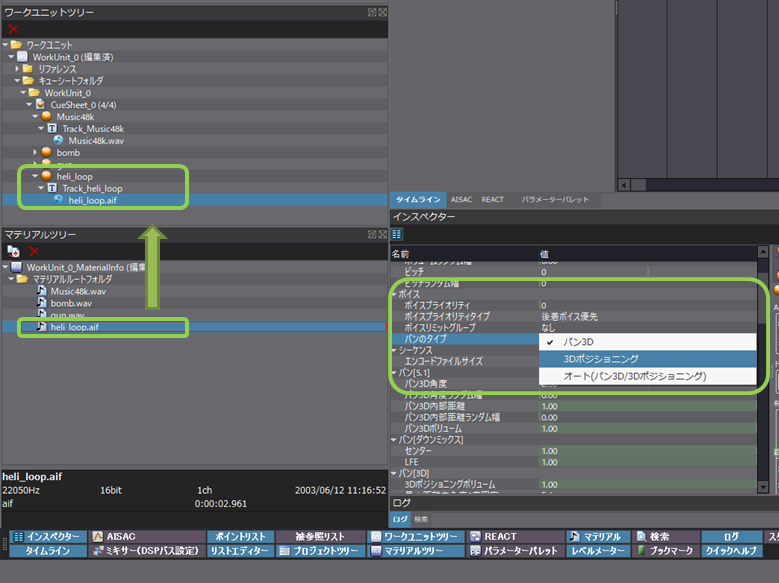
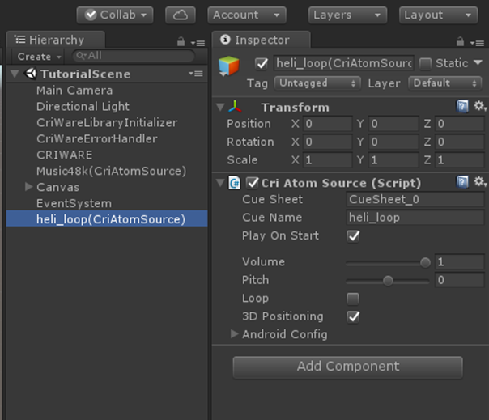
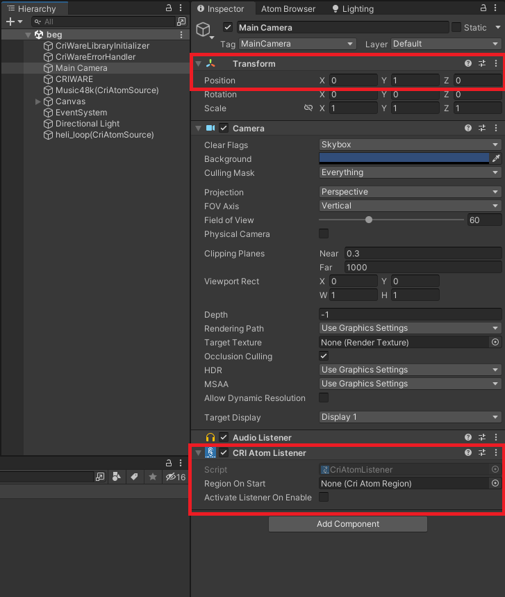
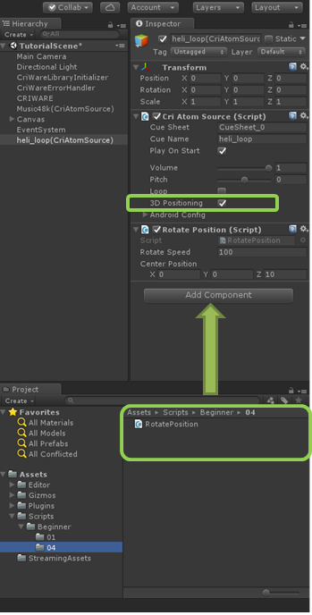
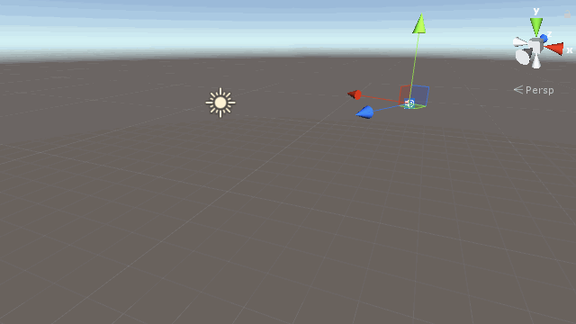

## 初级篇04：播放3D声音
本节将介绍如何使用ADX2的3D声音。

### 什么是3D声音？
3D声音是一种声音设置，根据声音在游戏空间中的位置和方向，改变声音的聆听方式。<br/>
在ADX2中，这被称为3D定位。
* 基于听众和声源的速度，会出现多普勒效应
* 每个扬声器的输出都是根据听众和声源的位置自动计算的，呈现出左右环绕的效果

### Atom Craft中的设置
首先，你需要在Atom Craft中设置你的音频数据，以便3D定位播放。

如果数据已经启用了3D定位，请进入“Unity中的设置”。<br/>
(本教程在入门部分共享的音频数据，已经启用了3D定位。）

#### 设置3D定位
将想要开启3D定位的音频文件添加到项目中后，将其添加到CueSheet中。

添加到项目中时，一开始3D定位会被禁用。<br/>
如右图所示，将设置改为[Pan 3D]→[3D定位]或[自动（Pan 3D/3D定位）]。



※如果选择了[3D定位]，而[3D定位]在Unity播放端没有被启用，将会发生错误。<br/>
如果选择了[自动（Pan 3D/3D定位）]，设置会自动进行相应的切换。<br/>
对于必须以[3D定位]播放的音频，建议在Atom Craft设置中将Pan类型设置为[3D定位]。

#### 数据输出～导入到Unity中
改变Pan类型后，参照“入门篇02”中的步骤，将预置的数据导入Unity。



以上就是声音数据的准备。

### Unity中的配置
#### 添加一个CRI Atom Listener
下一步是在Unity中配置。<br/>
让我们添加一个CRI Atom Listener组件，这将是3D定位的基点。<br/>
如果不使用3D定位就没有必要添加CRI Atom Listener。

通常情况下，CRI Atom Listener组件会被连接到主摄像机（Main Camera）。<br/>
在下面的示例代码中，要旋转的游戏对象的中心是(0,1,0)，所以将摄像机放在圆心的(0,1,0)上。



#### 示例代码
为了看到3D定位的效果，我们让游戏对象旋转起来。<br/>
代码如下。

```csharp
public class RotatePosition : MonoBehaviour
{

    public float RotateSpeed = 100.0f;
    public Vector3 centerPosition = new Vector3(0, 0, 1.5f);

    void Update()
    {
        /* 绕圆心旋转 */
        this.gameObject.transform.RotateAround(centerPosition, new Vector3(0, 1, 0), Time.deltaTime * RotateSpeed);
    }
}
```

#### 启用3D定位
接下来，为[Cri Atom Source]激活[3D定位]，然后添加前面的示例代码。



点击Play，就能听见像直升机盘旋一样的声音。



### Tips
#### 如果不能正确听到声音
请再次检查以下项目。
1. 检查AtomCraft中的平移设置是否被设置为3D定位。
2. 检查CRI Atom Listener组件是否已被添加到主摄像机。
3. 如果直升机的声音固定在一个地方，[RotatePosition]脚本可能有误。

#### 了解更多关于3D定位的信息
如果你想了解更多信息，请查看UnitySDK手册的对应部分。
* <a href="https://game.criware.jp/manual/adx2_tool/jpn/contents/criatom_tools_atomcraft_pos3d.html" target="_blank">CRI ADX2 Tools手册 3D定位</a>
* <a href="https://game.criware.jp/manual/unity_plugin/jpn/contents/atom4u_keys_3dpos.html" target="_blank">CRIWARE Untiy Plug-in手册 3D定位</a>

