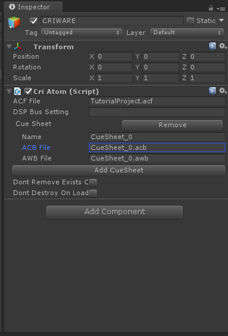
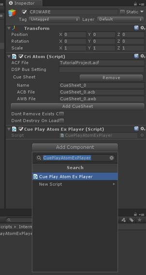
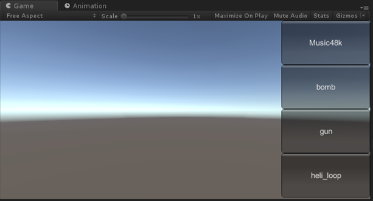

## 中级篇02：仅使用脚本播放声音
上一篇我们介绍了如何使用CriAtomSource和CriAtomExPlayer。<br/>
CriAtomExPlayer允许在一个脚本中完成从创建到播放控制的所有工作，当只需要简单的播放控制时，或者是需要创建一个独立于游戏场景的音频管理器类时，它是非常有用的。<br/>
这次我们将介绍如何使用CriAtomExPlayer来播放音频。

### 必需的游戏对象
在场景中添加以下游戏对象。<br/>
如果它们已经配置完毕，让它们保持原状即可。
* CriWareInitializer
* CriWareErrorHandler
* 已添加CriAtom组件的游戏对象

可以在“入门篇03”中了解如何添加这些游戏对象。

在场景中放置所需的游戏对象后，确保acb文件被注册在CriAtom组件的[ACB File]中。



现在已经完成了初始化库和加载CueSheet的准备工作。

### 添加脚本
本篇的示例代码如下。

```csharp
using UnityEngine;
using System.Collections;
using System.Collections.Generic;
using CriWare;

public class CuePlayAtomExPlayer : MonoBehaviour
{
    private CriAtomEx.CueInfo[] cueInfoList;
    private CriAtomExPlayer atomExPlayer;
    private CriAtomExAcb atomExAcb;

    IEnumerator Start()
    {
        /* 等待加载CueSheet文件 */
        while (CriAtom.CueSheetsAreLoading) {
            yield return null;
        }

        /* 生成AtomExPlayer */
        atomExPlayer = new CriAtomExPlayer();

        /* 获取Cue信息 */
        atomExAcb = CriAtom.GetAcb("CueSheet_0");
        cueInfoList = atomExAcb.GetCueInfoList();
    }
    private void OnDestroy()
    {
        atomExPlayer.Dispose();
    }

    void OnGUI()
    {
        /* 创建带有Cue名称的播放按钮 */
        for (int i = 0; i < cueInfoList.Length; i++) {
            if (GUI.Button(new Rect(Screen.width - 150, (Screen.height / cueInfoList.Length) * i, 150, Screen.height / cueInfoList.Length), cueInfoList[i].name)) {
                /* 播放中的话停止播放 */
                if(atomExPlayer.GetStatus() == CriAtomExPlayer.Status.Playing) {
                    atomExPlayer.Stop();
                }
                atomExPlayer.SetCue(atomExAcb, cueInfoList[i].name);
                atomExPlayer.Start();
            }
        }
    }
}
```

将CuePlayAtomExPlayer.cs添加到适当的游戏对象中。



### 示例代码的解释
#### 创建播放器

```csharp
/* 创建AtomExPlayer */
atomExPlayer = new CriAtomExPlayer();
```

上述脚本将创建一个CriAtomExPlayer实例。

#### 获取Cue信息列表

```csharp
/* 获取Cue信息列表 */
atomExAcb = CriAtom.GetAcb("CueSheet_0");
cueInfoList = atomExAcb.GetCueInfoList();
```

Cue信息可以通过向CriAtom.GetAcb函数指定CueSheet名称（.acb文件名）来获得。<br/>
在示例代码中，我们想引用CueSheet中包含的Cue名称，所以另外检索Cue信息列表。

#### Cue的设定和播放

```csharp
/* 为播放器设定Cue并开始播放 */
atomExPlayer.SetCue(atomExAcb, cueInfoList[i].name);
atomExPlayer.Start();
```

把之前获取的Cue信息传递给SetCue函数后，可以通过调用Start函数来播放声音。

### 播放声音
运行Unity时，Cue名称的按钮将出现在屏幕的右侧，如图所示。



按下Cue名称的按钮，包含在acb文件中的Cue就能播放了。
