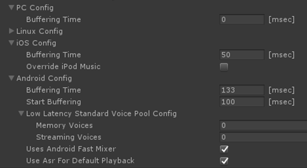
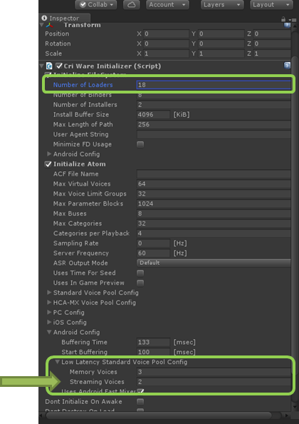
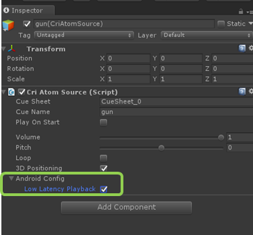

## 中级篇03：改善播放延迟
响应性的音频播放对于愉快的游戏体验至关重要，如用户点击屏幕时的音效，或者是与屏幕效果相匹配的音效。 
特别是在音乐游戏中，要尽可能地减少音频播放延迟。 
本篇将介绍如何改善音频播放延迟。

### 内存播放的使用
CRIWARE提供三种播放音频数据的方法。
* 提前将数据加载到内存中，并从内存中播放
* 依次读取数据的流播放
* 将上述混合起来的零延迟的流播放

对于需要高响应时间的音效，一定要将CRI Atom Craft设置为内存播放。 
请参考以下文章的设置说明。 
<a href="https://criware.info/memory-or-stream/" target="_blank">https://criware.info/memory-or-stream/</a>

※默认设置是在内存中播放。

### 调整缓冲时间
在CRIWARE Library Initializer组件的设置中，注意下图中的“缓冲时间（Buffering Time）”。 
这些是关于“在开始输出声音前必须缓冲多长时间的音频数据”的设置。 
如果在播放开始时有足够的数据缓冲，就有可能避免在播放过程中因数据不足而导致声音中断。

减少这个值可以缩短等待缓冲的时间，所以可以缩短开始播放和实际播放声音之间的时间。
特别是安卓系统的默认设置为高值，这样即使在非常老的设备上也不会出现声音中断，所以要大胆地尝试去减少这个值。
只要确保在应用程序支持的设备上不发生声音中断。

### 服务器频率设置
同样，改变CRIWARE Library Initializer组件中的服务器频率（Server Frequency）设置也可以略微改善播放响应。

CRIWARE在服务器线程中处理从应用程序主线程调用的指令。 
服务器频率是执行该服务器处理的频率。 
设定一个较高的值可能会导致实际处理播放开始指令的时间间隔缩短，从而缩短声音输出的等待时间。

上文的“可能”是因为即使处理过程的执行速度稍快，也往往没有明显的效果，因为之后会出现缓冲等导致的较长等待时间。 
如果看起来没有什么明显效果，就不应该把服务器频率设置得太高，因为这样会增加CPU的处理负载。 
保持与应用程序帧率相同的水平即可。

### 改善安卓系统的播放延迟（低延迟播放）
如果在安卓设备上运行程序，即使采取了到目前为止所描述的措施，延迟可能仍然很高。 
CRIWARE为Android提供了一个特殊的“低延迟播放”功能。 
这需要进行一些额外的设置。

**注意** 
在标准音频池中，每个Streaming Voices（播放的流媒体数量）需要一个CriFsLoader句柄，以实现低延迟播放。 
因此，如果增加[Streaming Voices]的值，也要增加[Initialize FileSystem]的[Nubmer of Loaders]的值，如图所示。

这次我们将内存播放的音频池设为3，流媒体播放的音频池设为2。 
(因为增加了两个流播放用的音频池，所以将[Nubmer of Loaders]增加两个)。

接下来，勾选CriAtomSource组件中的“低延迟播放”复选框。

以上就是低延迟播放的使用方法。 
在实际设备上检查操作时，可以看到与正常播放相比，播放延迟明显减少。

### Tips
#### 使用低延迟音频播放时的限制
这个功能只应该用于SE和其他需要尽可能减少延迟的音频，播放BGM和带有效果器的声音请使用通常播放。 
在播放低延迟音频池的音频时，有以下的限制。
* 只能使用ADX/HCA编解码器；如果使用HCA-MX，会没有效果。
* 不能使用包络功能。如果数据中设置了一个包络，则会被忽略。
* 低延迟播放标准音频池的最大数量被限制在27个，用于内存和流播放。
* 声音数据的采样率需为48000Hz或更低。
* 只能进行2D Pan和音量调整。不能使用音高调整、混响和其他效果功能（DSP）。

※不只是运行时的音高调整，其他基于CRI Atom Craft方面设置的Cue的音高变化也将无效。

#### 用于低延迟声音播放的音频池的数量
低延迟声音播放的音频池的最大数量是6。 
（内存播放的音频池数量）+（流播放的音频池数量）的总和必须小于这个值。 
但是，如果启用了Untiy标准音频，上限则降低到5。

关于在安装CRIWARE插件时改变Unity标准音频设置的信息，请参考如下文章。 
<a href="https://game.criware.jp/manual/unity_plugin/jpn/contents/atom4u_tips.html" target="_blank">https://game.criware.jp/manual/unity_plugin/jpn/contents/atom4u_tips.html</a>

#### 如何指定低延迟的声音播放和标准播放
当用CriAtomSource在默认状态下播放音频时，如果“Low Latency Playback”复选框没有设置为 “true”，则会根据声音的可用性，从声音库中自动分配标准或低延迟播放。 
如果需要明确设置不进行低延迟播放，请执行以下操作之一：
* 调用CriAtomExPlayer::SetSoundRendererType，为每个音源指定ASR。
* 在CRI Atom Craft工具中，使用参数设置声音渲染器类型。

#### CRIWARE插件的播放机制
以下的文章解释了CRIWARE插件中音频播放的工作原理。 
<a href="https://game.criware.jp/manual/unity_plugin/jpn/contents/atom4u_keys_playback.html" target="_blank">CRIWARE Unity插件手册 基本播放机制</a>
