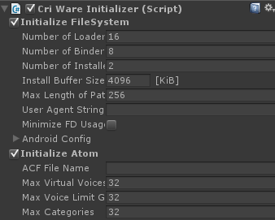
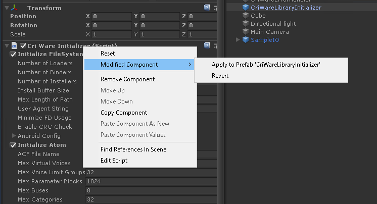

## 中级篇04：关于初始化参数
CRIWARE有一系列的初始化参数，适当地设置这些参数可以
* 减少内存的使用
* 减少播放延迟
* 提高性能

然而，不正确的设置会导致资源消耗过多，在某些情况下会出现警告和错误，使CRIWARE的功能无法按预期工作。 
本节将介绍如何设置初始化参数以及常见故障案例。

## CRIWARE Library Initializer组件
这是一个CRIWARE插件的初始化设置总览。 
该组件使设置初始化参数变得容易。

我们推荐以下用法：
* 勾选[Don't Destroy On Load]复选框
* 预制所有使用CRIWARE的场景。
* 在Prefab中反映参数更新。

### 勾选[Don't Destroy On Load]复选框
如果[Don't Destroy On Load]复选框被禁用，在切换场景时，库将会被终止。在大多数情况下，没有必要为每个场景初始化库。 
此外，库功能可以在切换场景前后使用，所以BGM可以跨场景保留播放，使演出很方便。

### 预制所有使用CRIWARE的场景
将Initializer放在所有的场景中，以便在开发过程中无论运行哪个场景都可以使用CRIWARE的功能。 
在这种情况下，Prefab功能允许你统一管理所有的初始化参数，在添加一个新场景时非常有用。

### 在Prefab中反映参数更新
除非需要非常严格的内存管理，否则初始化参数应该是整个游戏所共有的，库应该只在启动时被初始化一次。 
然而，在开发过程中，有时你会发现某个特定场景的问题并调整参数。 
如果改变了设置，别忘了在Prefab中反映出来。

### Tips
* 在整个应用程序中，只有一个CRIWARE Library Initializer存在。
  * 如果在多个场景中设置了CRIWARE Library Initializer，并进行了场景切换，可能会显示2个，但它们是没有内容的无效对象。
  * 这些东西会随着场景被废弃时一起废弃，所以没有真正的损害。
* CRIWARE Library Initializer也可以从[GameObject]->[CRIWARE]->[创建CRIWARE Library Initializer]菜单中创建。在这种情况下，它被创建为一个游戏对象。
* 在手册的以下几页，你会发现每个设置项目的解释。
<a href="https://game.criware.jp/manual/unity_plugin/jpn/contents/cri4u_component_initializer.html" target="_blank">CRIWARE Library Initializer</a>
* 即使是默认值，初始化参数也可以在一定程度上使用。出现内存不足等问题时，如果你想执行一个特定的操作，建议调整初始化参数。

也可以从脚本中初始化CRIWARE库而不使用组件。

### 故障排除
在这里你可以找到关于初始化参数和如何处理这些参数的常见问题。
#### 当大量的声音效果被播放时，出现多个“W20XXXX”警告。
[Max Virtual Voices]的数量可能低于同时播放的声音数量。 
在这种情况下，[Max Virtual Voices]的数量应该设置得比同时播放的声音数量要高。

#### 即使设置了流播放声音的数量，但不能大量进行流播放
增加[File System Config]中的[Nubmer of Loaders]值，使其和流播放声音的增加的数量一样多。 
在流媒体播放时，必须增加[Atom Config]中[Streaming Voices]的音频池数量，同时也必须增加[Nubmer of Loaders]，以便在流播放时加载文件。

#### 启用低延迟播放后没有声音
将低延迟音频播放的音频池总值（用于内存播放的音频池数量）+（用于流播放的音频池数量）设置为6或更少。 
（如果启用了Unity标准音频，请将此设置为5或更少）。 
如果超过了这个限制，可能会出现问题，例如在试图播放音频时，不能正常播放。

#### 在某些平台上出现了问题
请先查看手册中的具体平台信息。 
<a href="https://game.criware.jp/manual/unity_plugin/jpn/contents/cri4u_tgtspc.html" target="_blank">CRIWARE Unity插件手册 - 具体平台信息</a>

如果有不能解决的问题，请联系我们。
  