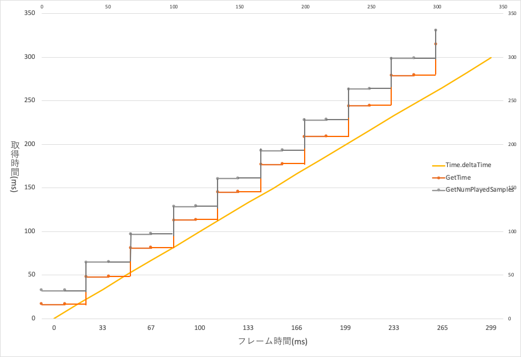

## 中级篇05： 获取音频的播放时间（通常获取和已播放的样本数）
在各种情况下，你可能想获得正在播放的歌曲的时间，例如在音乐游戏中，或者是在游戏中配合背景音乐制作各种演出效果。<br/>
在本节中，我们将介绍如何获取音频的播放时间。

### 如何获取音频的播放时间
在CRIWARE插件中，有三种方法来获取音频的播放时间。
这些方法中的每一种都有其优点和缺点。

| 方法              | 优点       | 缺点            |
|-----------------|----------|---------------|
| 通常的播放时间（毫秒）     | 易于获得     | 严格来说，不是“播放时间” |
| 播放的样本数          | 能匹配输出的声音 | 不易于增加，需要转换为时间 |
| 使用音频同步计时器的播放时间	 | 能匹配输出的声音 | 需要初始化，且需要谨慎使用 |

让我们更详细地看一下每种方法。

### 通常的播放时间
播放时间可以通过CriAtomExPlayer.GetTime和CriAtomExPlayback.GetTime获得。

上述函数获取的是“自播放开始以来所经过的时间”。<br/>
因此，即使播放声音因某种原因中断，播放时间也会继续往上增加。

获取播放时间的最简单的示例代码可以写成以下内容。<br/>
注意，如果在同一个播放器上播放了多个声音，并且执行了这个函数，这个函数会返回最后播放的声音的播放时间。

```csharp
/* 创建AtomExPlayer */
CriAtomExPlayer atomExPlayer = new CriAtomExPlayer();
atomExPlayer.SetCue("Cue1");
atomExPlayer.Start();

// 中间部分省略

private void Update(){
    /* 获取AtomExplayer的播放时间 */
    long playerGetTimems = atomExPlayer.GetTime();
}
```

如果你想获取多个声音的播放时间，可以准备多个播放器，并获取每个播放器的时间，但也可以只用一个播放器获取播放声音对象的时间。

```csharp
/* 创建AtomExPlayer */
CriAtomExPlayer atomExPlayer = new CriAtomExPlayer();

/* 为每个Cue保留一个播放声音的对象 */
atomExPlayer.SetCue("Cue1");
CriAtomExPlayback playback1 = atomExPlayer.Start();
atomExPlayer.SetCue("Cue2");
CriAtomExPlayback playback2 = atomExPlayer.Start();

// 中间部分省略

private void Update(){
    /* 取得各自的播放时间 */
    long playback1Time = playback1.GetTime();
    long playback2Time = playback2.GetTime();
}
```

### 已播放的样本数
已播放的样本数和采样率可以通过CriAtomExPlayback.GetNumPlayedSamples获得。<br/>
与获取正常播放时间相比，可以获取实际播放的样本数，使波形数据和视频的同步更加精确。<br/>
然而，由于可以获取的数值是样本数，必须在获取后转换为时间。

```csharp
/* 获取已经播放的样本数 */
long numsamples;
int samplingrate;
playback.GetNumPlayedSamples(out numsamples, out samplingrate);

/* 单位转换 */
float playbackTime = numsamples / (float)samplingrate * 1000.0f;
```

下图是用图中介绍的方法得到的数值。（AtomConfig.ServerFrequency : 30Hz）



从API获取的时间也随着时间的推移而增加，但它是不稳定的。<br/>
这是因为这两个时间是由音频处理（Atom服务器处理）更新的，它在一个单独的线程中进行。<br/>
因为服务器的处理频率被（故意）设置为30帧，所以在60帧的主线程中获得时间并不一定意味着每一帧的时间都被更新。

在下一篇文章中，我们将讨论CriAtomExPlayback.GetTimeSyncedWithAudio，它允许你获得更流畅的播放时间。
