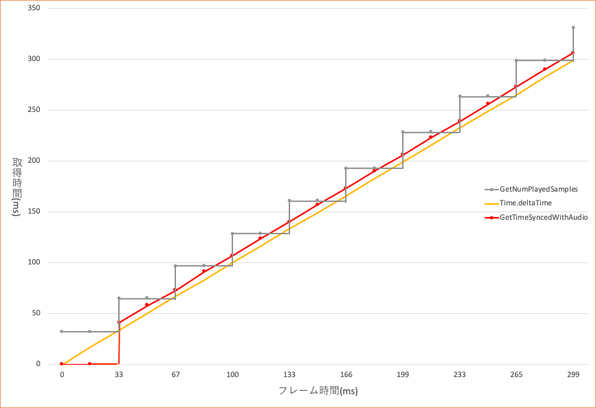

## 中级篇06：获取音频的播放时间（音频同步计时器部分）
### 使用音频同步计时器的播放时间
首先，请看下图。



下图显示了之前介绍的的GetNumPlayedSamples和基于音频同步计时器的GetTimeSyncedWithAudio。<br/>
可以看出，用GetTimeSyncedWithAudio获得的值具有很高的计数粒度，而且可以获得与正在播放的音频完全同步的播放时间。

此外，如果声音的播放被打断，例如在智能手机上插入或拔出耳机时，这些播放时间将暂时停止更新，并始终返回一个与正在输出的声音同步的时间。

现在我们将介绍两种获取音频同步计时器的播放时间的实现方法。

### 1. 使用CriAtomExPlayer时
要使用CriAtomExPlayback.GetTimeSyncedWithAudio函数，必须创建一个专门的CriAtomExPlayer，并启用音频同步计时器标记。可以用脚本创建一个CriAtomExPlayer，如下图所示，用来播放Cue并获得与音频同步的播放时间。

```csharp
/* 创建带有音频同步计时器的AtomExPlayer */
CriAtomExPlayer atomExPlayer = new CriAtomExPlayer(true);
atomExPlayer.SetCue("Cue1");
CriAtomExPlayback playback = atomExPlayer.Start();

private void Update(){
    /* 获取和音频同步的播放时间 */
    long playTime = playback.GetTimeSyncedWithAudio();
}
```

### 2. 使用CriAtomSource时
如果你希望在使用CriAtomSource组件的功能时使用上述音频同步计时器的播放时间，你可以定义一个继承自CriAtomSource的特定应用类，以获得与音频同步的播放时间。<br/>
通过覆盖初始化创建一个专门的CriAtomExPlayer，如下所示。

```csharp
using UnityEngine;
using System.Collections;
using CriWare;

public class MyAtomSource : CriAtomSource {
    protected override void InternalInitialize()
    {
        CriAtomPlugin.InitializeLibrary();
        /* 创建一个启用了enableAudioSyncedTimer标记的播放器 */
        this.player = new CriAtomExPlayer(true);
        this.source = new CriAtomEx3dSource();
    }
}
```

### 注意
GetTimeSyncedWithAudio因为每次调用都会更新时间，所以每帧只获取一次。
