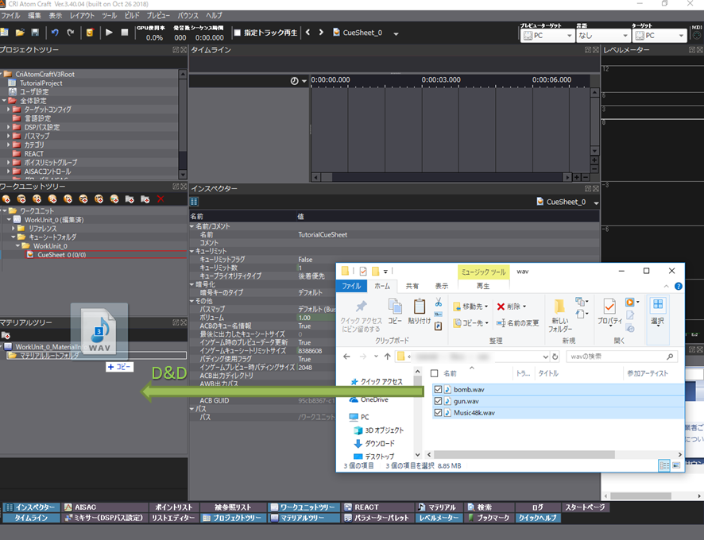

## 番外篇：使用CRI Atom Craft为Unity创建声音数据
让我们用CRI Atom Craft来转换音频文件。
如果你没有音频文件，但想知道如何使用CRI Atom Craft，可以使用我们提供的<a href="http://www.criware.jp/adx2/demo/download_j.php" target="_blank">教程项目</a>。

### 启动CRI Atom Craft
对于Windows，启动[/cri/tools/criatomex/win/CRIAtomCraft.exe]。 
对于Mac，启动[/cri/tools/criatomex/mac/CRIAtomCraft.app]。

### 创建一个新的项目
在Atom Craft中管理音频文件之前，需要创建一个项目。 
启动Atom Craft并选择[新建]。

在[新项目]对话框中，将项目名称改为“TutorialProject”。

为WorkUnit使用默认的[WorkUnit_0]命名。

这样就创建了一个项目。

### 注册音频文件
当创建一个新的项目时，有一个预先准备的CueSheet[CueSheet_0]。首先，添加音频文件。

接下来，将声音文件注册到CueSheet[CueSheet_0]。 
通过注册，它将成为ADX2声音数据的构建目标，可以在程序里播放。

现在，该音频文件已经注册完毕，并可以在应用程序中作为Cue播放。

### 改变音频文件的设置
注册的音频文件可以改变其播放和构建设置。 
本次我们将改变流播放类型。

双击添加到[素材树]的音频文件名称，在检视器窗口中将[加载方法]改为[流]。 
通过为长数据选择[流]，可以在不挤占内存的情况下进行播放。 
※采样数据为[Music48k.wav]。

### 为Unity导出ADX2数据
现在，将[CueSheet_0]与注册的音频文件构建为Unity的ADX2声音数据。 
右键单击[CueSheet_0]并选择[构建Atom CueSheet二进制文件]。

接下来，配置构建时的设置。 
这次是针对Unity的，所以启用Unity Assets输出。

按下[构建]按钮后，当构建完成时，会输出以下日志。

检查实际的输出文件。 
在构建日志窗口中选择[打开输出文件夹]。

文件被生成到以下目录。 
[~Documents\CRIWARE\CriAtomCraft\TutorialProject\Public\Assets]。

生成的文件请参考以下内容。
* ACF文件（*.acf）：环境设置和CueSheet的共同信息，每个项目生成一个文件。
* ACB文件（*.acb）：波形数据、Cue信息和播放参数，用于每个CueSheet的内存播放。
* AWB文件（*.awb）：每个CueSheet的流播放的波形数据。仅在设置为[流]时生成。

### 在Unity中导入ADX2声音数据
将刚刚建立的数据导入Unity。 
首先，在Unity的顶部选择[Window]→[CRIWARE]→[Open CRI Atom Window]。

勾选[Use Copy Assets Folder]并选择[Select Assets Root]。

选择刚才的[Assets]文件夹。

选择[Update Assets of "CRI Atom Craft"]，从资产文件夹导入文件。

如果你检查Unity中的StreamingAssets文件夹，会看到刚刚生成的文件已经被导入。

