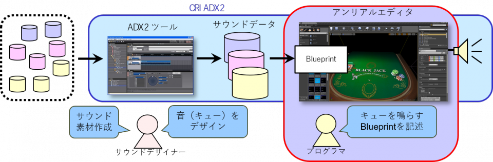

## 准备篇00 一开始需要了解的UE4版CRI插件的基础知识

### 什么是CRIWARE UE4插件？
 CRIWARE UE4插件是一个在虚幻引擎4（以下简称UE4）上的插件，它使用ADX2音频播放中间件、Sofdec2视频播放中间件和File Magic PRO文件管理中间件。 
 本教程将向你展示使用这个插件的步骤，包括图片说明。 
 在本教程结束时，你将会很好地掌握如何使用这个插件。另外，本章是对基础知识的介绍，如果你想了解实际的使用程序，可以跳过本章。
 
### 如何获得CRIWARE UE4插件？
请通过下面的“试用请求页面”与我们联系。你可以无限期地免费试用该插件的完整版本。 
※这项服务是为企业客户提供的。 
<a href="http://www.cri-mw.co.jp/contact/game.html" target="_blank">试用申请和咨询</a>

对于个人开发者和独立游戏开发者，可以使用CRI ADX2 LE声音中间件的免费版本，它的功能几乎与商业版本相同。 
你可以从以下页面获取。 
<a href="https://www.adx2le.com/download/index.html" target="_blank">CRI ADX2 LE版下载</a>

### 关于工作流程
接下来介绍用CRIWARE UE4插件实现声音的工作流程。 
首先，准备一定数量的音频素材（Wav数据格式）。 
然后，使用CRI Atom Craft声音创作工具为游戏处理声音数据，并将构建的声音数据导入UE4。 
然后写出播放Cue的蓝图和控制播放的蓝图。 
（也可以用C++代码来实现） 

### 用语集
本页包含用于描述CRI产品的术语表。 
如有必要，请参考它。

### 关于用CRI Atom Craft建立的声音数据
当用CRI Atom Craft构建时，会产生一个“.acf ”文件和几个“.acb”和“.awb”文件。 
这些统称为声音数据。

#### 什么是ACF文件？
一个ACF文件是一个扩展名为acf的文件。 
该文件包含CRI Atom Craft中设置的类别分类、AISAC设置、总线设置等。

#### 什么是ACB文件？
ACB文件是一个扩展名为acb的文件。 
该文件包含CRI Atom Craft中创建的每个CueSheet的二进制信息。 
设置为“内存播放”的波形数据也被记录在这个文件中。

#### 什么是AWB文件？
一个AWB文件是一个扩展名为awb的文件。 
设置为“流播放”的波形数据被记录在这个文件中。

#### 当ACF文件被导入时，会发生什么？
导入一个ACF文件会生成一个AtomConfig uasset。 
这个uasset包含了ACF文件的所有信息。 
导入后，就不再需要ACF文件了。

#### 当ACB文件被导入时，会发生什么？
导入ACB文件会生成一个AtomCueSheet和一个AtomCue uasset。
AtomCueSheet uasset包含CRI Atom Craft创建的每个CueSheet的二进制信息。
一个AtomCue是一个uasset，它与AtomCueSheet中包含的声音Cue是一对一的。（这个uasset是用来指示应该播放哪个Cue的）
导入后，就不再需要ACB文件了。

#### AWB文件的使用不需要导入
AWB文件的使用不需要导入。
请继续阅读本教程，了解如何使用它的详细说明。

### Tips
#### 怎样才能了解更多关于用CRI Atom Craft建立的声音数据？
请参阅SDK附带的手册中的以下章节。
cri\documentation\csCRI_ADX2_Manual_pc_j.chm
CRI ADX2手册 > 导入指南 > 基础 > 文件
#### 怎样才能了解更多关于导入时产生的资产？
请参考SDK附带的手册中的以下章节。
cri\documentation\CRIWARE_UE4_Plugin_Manual_j.chm
CRIWARE虚幻引擎4插件手册 > 使用说明 > 初始设置 > 载入数据