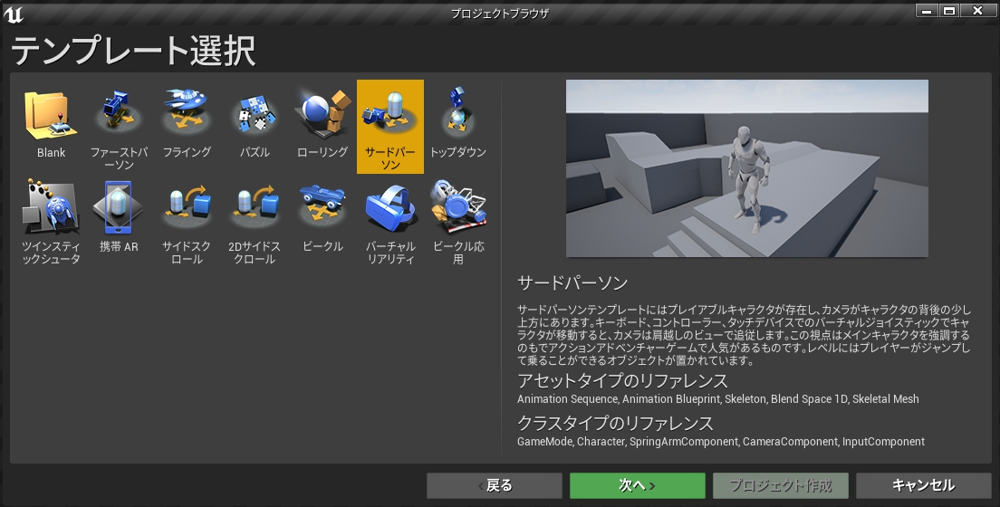
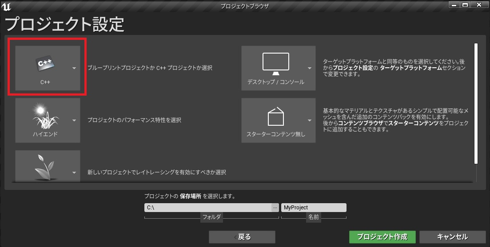
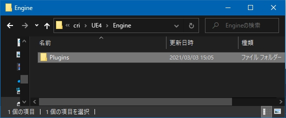
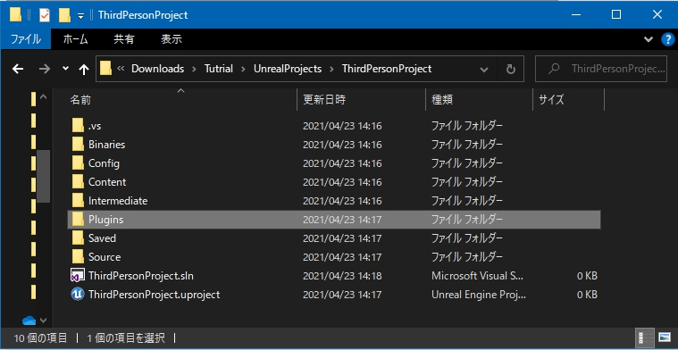
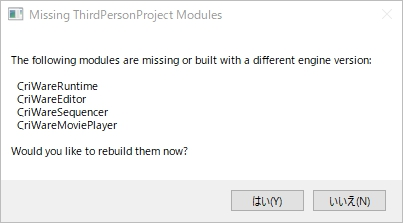
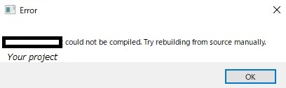

## 入门篇01 导入CRI的UE4插件
本届讲述如何导入CRI的UE4插件，使ADX2声音数据在UE4上播放。

### 要准备什么
* 虚幻引擎（本教程文章基于虚幻引擎4.26.2）
* 微软Visual Studio 2017或2019
* CRI的UE4插件的LE版本（本教程文章基于CRIWARE UE4插件v.1.29.00.00）。
* <a href="https://game.criware.jp/wp-content/uploads/2019/10/tutorial_sample_ue4_lesson01.zip" target="_blank">ADX2的LE版的声音数据（入门篇02也会用到）</a>

### 创建一个UE4项目
(1) 启动UE4编辑器。 
(2) 选择模板“第三人称”。 

(3) 始终选择C++创建一个新的项目。 

※如果创建新项目失败，请检查以下项目。
* 检查Microsoft Visual Studio是否正确安装
* 尝试手动构建

### 在UE4项目中导入CRI插件
(1) 如果UE4编辑器目前正在运行，退出编辑器。 
(2) 打开CRI插件的“/cri/UE4/Engine”文件夹。 
(3) 将“"Plugins”文件夹复制到那里。 

(4) 直接粘贴在UE4项目下。 

(5) 打开UE4项目。（双击uproject文件）。 
(6) 如果出现以下弹出窗口，选择“是”。 
 
(7) 如果UE4编辑器成功启动，CRI插件的导入就完成了! 
如果显示以下错误对话框，请参考 “<a href="https://game.criware.jp/manual/ue4_plugin/latest/contents/criware_ue4_trouble_could_not_be_compiled.html" target="_blank">安装CRI插件时显示‘~无法编译’时该怎么办（日文）</a>”。 

### Tips
#### CRI插件的安装还有其他方法
欲了解更多信息，请参见手册的以下章节。 
<a href="https://game.criware.jp/manual/ue4_plugin/contents/criware_ue4_install.html" target="_blank">CRIWARE UE4插件的安装说明（日文）</a>