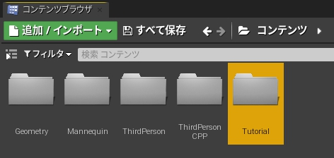
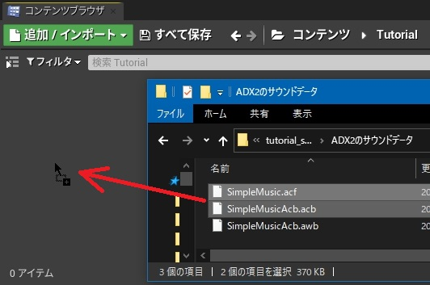
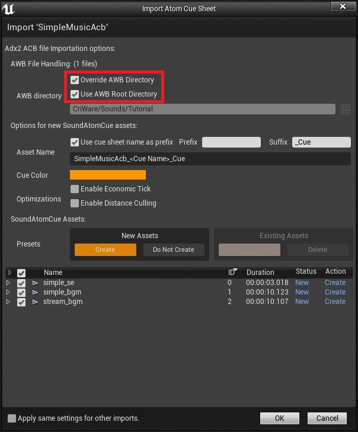
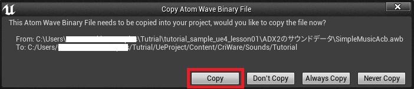
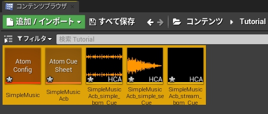
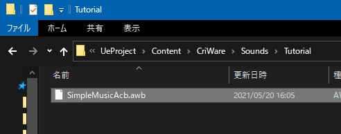

## 入门篇02 导入ADX2的数据
### 导入ADX2声音数据
(1) 打开虚幻编辑器，在内容下面直接创建一个名为“Tutorial”的文件夹。 

(2) 将 "ADX2声音数据 "中的 "SimpleMusic.acf "和 "SimpleMusic.acb "拖入先前创建的 "Tutorial "文件夹。 

(3) 然后出现导入对话框。 
勾选“Override AWB Directory”和“Use AWB Root Directory”并按“OK”。 

(4) 接下来，出现复制对话框。 
选择“Copy”。 

(5) 之后会生成一些资产文件。 

此外，“SimpleMusicAcb.awb”文件也将被复制到“[Unreal project folder]/Content/CriWare/Sounds/Tutorial ”文件夹中。 

这样就完成了导入。

### Tips
#### 了解更多关于用CRI Atom Craft建立的声音数据的信息
请参考以下链接。 
* <a href="https://game.criware.jp/manual/adx2_tool/jpn/contents/criatom_tools_atomcraft_acb_file.html" target="_blank">关于ACB文件</a>
* <a href="https://game.criware.jp/manual/adx2_tool/jpn/contents/criatom_tools_atomcraft_awb_file.html" target="_blank">关于AWB文件</a>
* <a href="https://game.criware.jp/manual/adx2_tool/jpn/contents/criatom_tools_atomcraft_acf_file.html" target="_blank">关于ACF文件</a>

#### 了解更多关于导入时产生的资产的信息
参考手册的以下章节： 
<a href="https://game.criware.jp/manual/ue4_plugin/contents/criware_ue4_data_loading.html" target="_blank">导入数据</a>

#### 了解更多关于导入对话框的信息
参考手册中的以下章节： 
<a href="https://game.criware.jp/manual/ue4_plugin/contents/criware_ue4_data_loading.html" target="_blank">Atom CueSheet Import Dialog的概述</a>