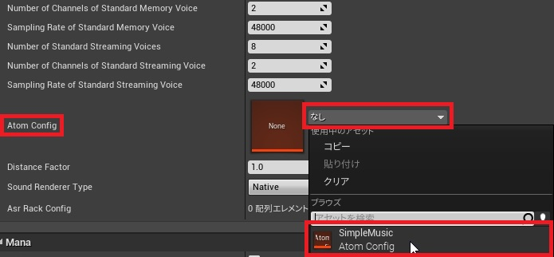

## 入门篇03  配置CRI插件

### 配置CRI插件
(1) 在UE4编辑器中打开项目设置。 

(2) 在插件部分选择“CriWare”。 

如果这个页面不能被编辑，如下图所示，请关闭项目设置窗口并再次打开。 

(3) 在“Atom Config”字段中设置刚刚生成的资产。 

(4) 将“Distance Factor”值设为0.01。 

这样就完成了设置。 
为了让设置生效，关闭UE4编辑器并再次打开它。

### Tips
#### 为什么要配置“Atom Config”？
将“Atom Config”的配置通过AtomConfig uasset的设置反映出来。 
这意味着类别和总线设置等设置会得到反映。

#### 为什么要设置“Distance Factor”？
它使3D声音听起来更自然。 
UE4和Atom Craft使用不同的距离单位（UE4为厘米，Atom Craft为米），所以如果“Distance Factor”被设置为1，就会出现诸如 “声源和听众被判断为很远，尽管在UE4中他们很近 ”的不便之处。

#### 了解更多关于CRI插件的设置
请参考手册的以下章节： 
<a href="https://game.criware.jp/manual/ue4_plugin/contents/criware_ue4_initialize_parameter.html" target="_blank">CRIWARE初始化参数的细节（日文）</a>