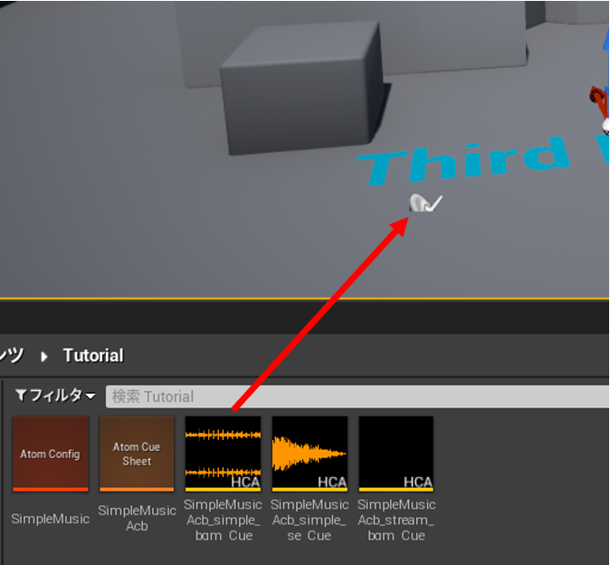

## 入门篇04 发出声音

### 发出声音
将“SimpleMusicAcb_simple_bgm_Cue”资产拖放到关卡上。 

开始游戏时，就能听到声音了！

### Tips
#### 如果没有发出声音
**如果你正在使用本教程中分发的ADX2声音数据** 
一定要选择“SimpleMusicAcb_simple_bgm_Cue”并把它放在关卡上。

**如果你使用的是自己准备的ADX2声音数据** 
我们强烈建议使用本教程中分发的ADX2声音数据。 
如果你想给设置为流播放的Cue发声，需要单独进行设置。下一篇文章将会做出解释。 
如果你试图对设置为三维定位的Cue进行发声，由于定位或设置的原因，音量可能为零。

#### 小技巧
把鼠标悬停在内容浏览器中的AtomCue资产上时，会出现一个播放按钮。 
通过按下这个播放按钮，你可以当场播放声音。 
当你想检查哪个AtomCue资产是想要播放的声音时，请使用这个功能。