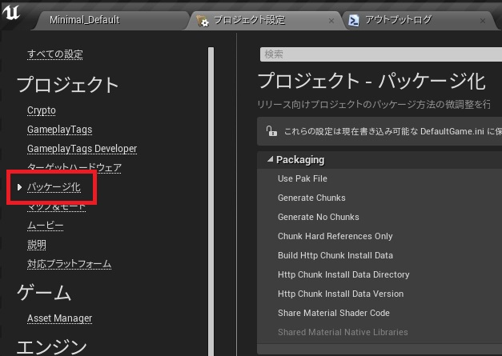
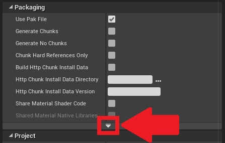
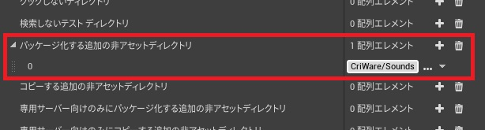
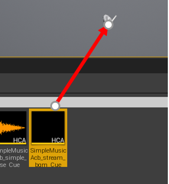

## 入门篇05 流播放
### 什么是流播放
本文所介绍的流播放，是指 “在逐渐将文件载入内存的同时，播放文件中的音频数据”。

**优势**
* 节约内存
* 减少场景转换时的加载时间

**劣势**
* 需要访问磁盘
* 在发出播放命令和实际播放之间有一个时间滞后（但有办法规避这个问题）

详细请参考<a href="https://game.criware.jp/manual/adx2_tool/latest/criatom_tools_atomcraft_streaming_type.html" target="_blank">这篇文章（日文）</a>。

### 如何设置流播放
设置是在CRI Atom Craft一侧进行的。 
详情请见<a href="../../ADX Tutorial/Ch-1-Data-Creation/ADX_Part_02.md" target="_blank">“CRI Atom Craft 入门篇.02/压缩设置，流媒体播放设置”</a>。 
在本教程的<a href="ADX-UE-01.md" target="_blank">“入门篇.01中公开的“ADX2数据”</a>中提供了为流播放设置的Cue“stream_bgm”，请使用这个Cue。

### 在流播放之前
为了避免描述上的混乱，请删除在前一个教程中（入门篇.04）放置在关卡中的声音。

### 流播放的步骤
#### 检查AWB文件的位置
检查“SimpleMusicAcb.awb”文件是否位于“[Unreal project folder]/Content/CriWare/Sounds/Tutorial”文件夹中。 
如果没有找到，请回到 <a href="ADX-UE-02.md" target="_blank">“入门篇.02/导入ADX2的数据”</a>，以与所述内容相同的方式导入。

**注意** 
始终导入AWB文件，而不是手动复制它。 
这是因为在导入过程中会自动进行适当的设置。 
还有一种方法是手动复制和配置AWB文件，但在入门篇中不会提到。

#### 编辑项目设置
打开UE4项目，显示“项目设置”下的“打包”页面。 

查看Packaging部分的详细设置。 

在“需要打包的额外非资产目录”下，指定文件夹“[Unreal project folder]/Content/CriWare/Sounds”。 

#### 将Cue配置在关卡上
将“SimpleMusicAcb_stream_bgm_Cue”资产拖放到关卡上。 

### Tips
#### 为什么在项目设置中设置“额外的非资产目录打包”？
因为如果不设置，AWB文件在打包时将不会被包含在软件包中。 
这导致了流播放没有声音的问题。 
如果你收到一个错误，说明找不到AWB文件，首先检查这个设置是否正确。
#### 什么是Cue？
请参考<a href="https://game.criware.jp/learn/glossary/#cue" target="_blank">用语表（日文）</a>。
