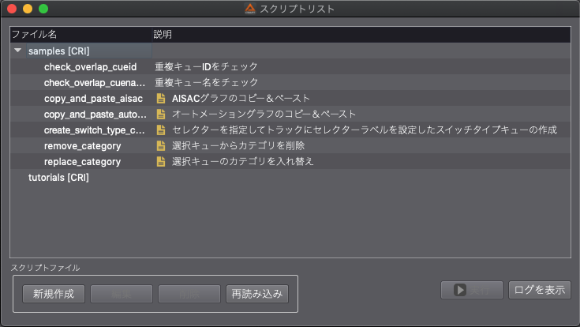

## Robot教程篇 Part 2：数据的准备
在开始CRI Atom Craft Robot的教程之前，我们先准备好教程所需的数据。

### 教程文件夹相关
在解压缩/安装CRI ADX2 SDK包（或是CRI ADX2 Tools包）时，将会在以下位置创建一个教程文件夹：

**macOS**<br/>
```shell
~/Documents/CRIWARE/CriAtomCraft/tutorials
```

**Windows**<br/>
```shell
cri\tools\ADX2\ver.3\tutorials
```

教程文件夹的结构如下，它包含教程中使用的音频素材和一个文件夹，用于存放接下来为教程创建的脚本文件：

**macOS**<br/>
```shell
tutorials
 ┗━ robot
      ┃━ 344
      ┃    ┣━ local
      ┃        ┣━ tutorial_data      # 波形素材文件夹
      ┃        ┃   ┣━ tutorial_data01
      ┃        ┃   ┣━ tutorial_data02
      ┃        ┃   ┣━ tutorial_data03
      ┃        ┗━ Python              # 保存脚本的文件夹
      ┗━ 3xx
```

**Windows**<br/>
```shell
tutorials
 ┗━ robot
      ┗━ local
           ┣━ tutorial_data      # 波形素材文件夹
           ┃   ┣━ tutorial_data01
           ┃   ┣━ tutorial_data02
           ┃   ┣━ tutorial_data03
           ┗━ Python              # 保存脚本的文件夹
```

### 查看教程和示例文件夹
在”脚本菜单”中选择“脚本列表”来显示脚本列表窗口，此时我们会在初始脚本列表中看到 “samples[CRI]”和“tutorials[CRI]”这两个文件夹。



在此次教程中，我们将在这个“tutorials[CRI]”文件夹中创建脚本文件。<br/>
“tutorials[CRI]”文件夹的路径如下：

**macOS**<br/>
```shell
~/Documents/CRIWARE/CriAtomCraft/tutorials/robot/344/local/Python # 教程用
```
※344为robot版本号

**Windows**<br/>
```shell
cri\tools\criatomex_v3\win\tutorials\robot\local\Python # 教程用
```
