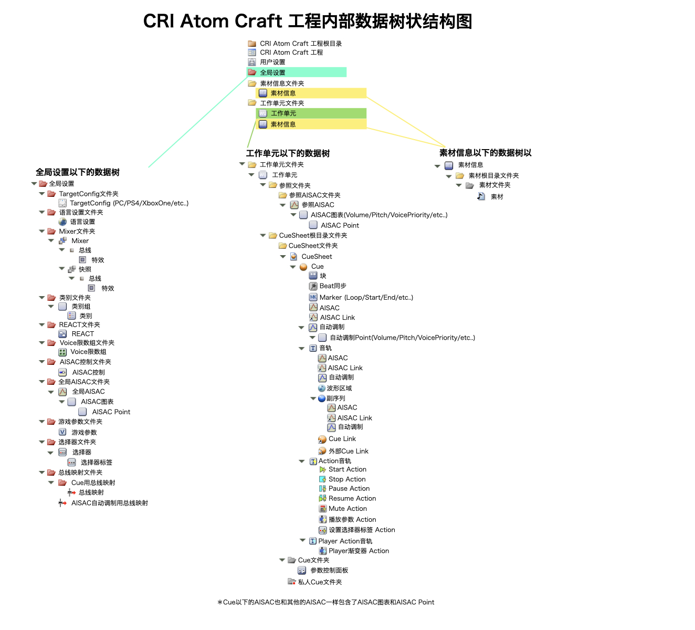

## Robot教程篇 Part 3：理解CRI AtomCraft的对象结构

### CRI Atom Craft项目树与CRI AtomCraft Robot操作的项目结构之间的关系
CRI Atom CraftRobot能直接操作CRI Atom Craft管理的对象结构。 
已经使用过CRI AtomCraft的读者会知道，一个项目中的各种对象元素是分别显示在三个树中的：“项目树”、“工作单元树”和“素材树”。 
也有一些对象没有显示在树上，但我们基本上可以理解为，一个对象的结构就是它在树上或专用视图中显示的结果。

### CRI AtomCraft的内部项目结构
在CRI AtomCraft项目中创建的各种对象的结构如下图所示：

在CRI Atom Craft Robot中，我们将经常执行以下操作：
* 在每个树的根对象下进行搜索
* 在指定的对象下创建一个子对象
* 将选定的对象移动到指定的对象下面

对象的结构是有规定的，所以我们无法随意地创建任何结构。