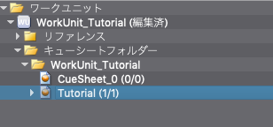
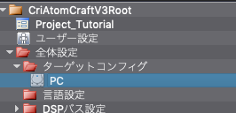
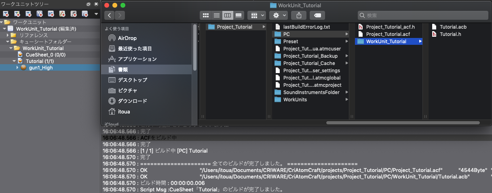

## Robot教程篇 Part 8：游戏数据（ACF，ACB）的输出

在本教程中，我们将使用<a href="../Ch-2-Project-Module/Atom_Craft_Robot_Part_06.md" target="_blank">“创建一个项目并注册波形文件”</a>教程中创建的项目，来编写一个能够创建游戏数据（ACF和ACB文件）的脚本。

### 准备脚本文件
在脚本菜单中，选择“脚本列表”。<br/>
在脚本列表窗口中按下 "新建 "按钮，创建一个脚本文件，名称如下：

| 脚本保存地址     | 脚本文件名                  |
|:-----------------|:----------------------------|
| tutorials [CRI]  | tutorial04-1_build_acb.py   |

### 脚本文件说明
双击刚刚创建的脚本，在脚本编辑器中打开它，并写上如下的描述语句：

```python
# --Description:[教程]输出游戏数据（ACF，ACB）
```

### 导入模块
完成脚本描述之后，请导入以下模块：

```python
import cri.atomcraft.project as acproject
import cri.atomcraft.build as acbuild
```

除了导入在CRI AtomCraft中操作项目数据的project模块外，我们还将导入build模块来创建游戏数据。<br/>
在CRI AtomCraft中，创建游戏数据的过程被称为“构建”。

### 获得构建所需的信息
为了构建一个CueSheet并创建一个ACB文件，我们需要以下对象：
* CueSheet
* 目标配置：输出平台的设置
* 语言设置：本地化设置（可选）

我们将编写一个脚本来获取构建所需的每一个信息。

#### 获取CueSheet
与"参数值的变更与预览"教程中的方法一样，我们将取得工作单元和它所包含的CueSheet。



```python
# 获取工作单元
workunit = acproject.get_workunit("WorkUnit_Tutorial")["data"]

# 获取CueSheet
cuesheet_rootfolder = acproject.get_cuesheet_rootfolder(workunit)["data"]

# 获取CueSheet文件夹“WorkUnit_Tutorial”
cuesheet_folder = acproject.get_child_object(cuesheet_rootfolder, "CueSheetFolder", "WorkUnit_Tutorial")["data"]

# 获取CueSheet
cue_sheet = acproject.get_child_object(cuesheet_folder, "CueSheet", "Tutorial")["data"]
```

#### 获取目标配置
目标配置是一个管理平台的构建设置的对象，在一般配置中管理。<br/>
以下函数用于从一般配置中获取目标配置文件夹。



| 函数名            | 说明                |
|:------------------|:--------------------|
| get_global_folder | 获取选择器文件夹等总体设置下方的文件夹 |

脚本如下所示：

```python
# 获取目标配置文件夹
target_config_folder = acproject.get_global_folder("TargetConfigFolder")["data"]
# 获取PC平台的设置
target_config_pc = acproject.get_child_object(target_config_folder, "TargetConfigPc", "PC")["data"]
```

##### <u>说明</u>
为了检索全局配置中管理的每个对象，首先使用get_global_folder函数从全局配置中获取对象文件夹。<br/>
get_global_folder函数需要指定“对象文件夹类型”。<br/>
获取对象文件夹之后，可以使用get_child_object函数来获取所需的目标配置。

#### 获取语言设置
建立用于本地化的数据需要指定语言设置，但本教程中没有使用。<br/>
语言设置的管理方式与全局配置中的目标配置相同。<br/>
要获得语言设置，使用get_global_folder函数来获得语言设置文件夹，然后使用get_child_object函数来获得所需的语言设置。

### 构建游戏数据
我们已经获取了构建所需的“CueSheet”和“目标配置”的信息。<br/>
现在将使用Build模块中的以下函数来编写构建过程：

| 函数名         | 说明                 |
|:---------------|:---------------------|
| build_cuesheet | 执行Cue Sheet Binary构建 |

构建的脚本如下所示：

```python
print("CueSheet“Tutorial”开始构建")
result = acbuild.build_cuesheet(cuesheet, target_config_pc, None)["succeed"]

if result == True:
    print("Script Msg：CueSheet“Tutorial”构建完毕")
else:
    print("Script Msg：CueSheet“Tutorial”构建失败")
```

#### 说明
我们将使用build_cuesheet函数构建游戏数据。<br/>
build_cuesheet函数用于指定“CueSheet信息”、“目标配置信息”和“语言设置信息”（可选，如果省略则设置为None）。<br/>
执行函数时，在构建指定的CueSheet和ACB文件的同时，全局配置和ACF文件也会被创建。<br/>
该函数的返回值会显示是否构建成功。我们将它被存储在变量result中，并作为日志输出的条件。

### 脚本的保存与运行
保存并运行该脚本。
如果成功构建，日志中将会输出“CueSheet‘Tutorial’构建完毕”。同时，ACF和ACB文件将被输出到新建的“PC”目标文件夹，该文件夹与项目文件在同一层次上。


